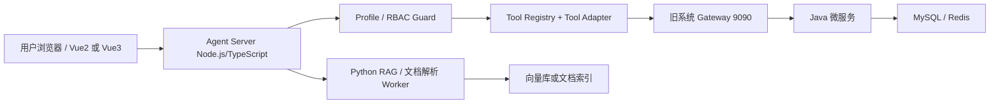

# Agent 接入设计报告

> 结论状态：架构设计基于静态代码证据，未实现、未部署。  
> 后端根目录：`D:\Files\BaiDu\SaaS项目测试demo\_整理结果\服务端代码-day17最终版`。  
> 前端根目录：`D:\Files\BaiDu\SaaS项目测试demo\_整理结果\客户端代码-day17最终版`。  
> 设计原则：Agent 只能复用当前用户权限，不得绕过 Shiro/RBAC，不得直接访问敏感数据。

## 1. 推荐总体方案：旁路 Agent Server

| 组件 | 推荐技术 | 职责 | 依据文件路径 |
|---|---|---|---|
| Agent Orchestrator | Node.js + TypeScript | 对话编排、Tool 白名单、权限上下文、审计、流式响应 | 旧前端已是 Node 工程，依据 `D:\Files\BaiDu\SaaS项目测试demo\_整理结果\客户端代码-day17最终版\package.json`；旧后端通过 HTTP API 暴露，依据各 Controller |
| RAG / 文档 Worker | Python | 文档解析、向量化、复杂离线任务 | 当前 Java 微服务未见文档解析能力，证据不足；作为旁路 Worker 避免侵入旧系统 |
| Tool Adapter | TypeScript | 将 Agent Tool 映射到旧 Java API，不允许模型自由拼 URL | API 清单依据 `D:\Files\BaiDu\SaaS项目测试demo\_整理结果\docs\api-inventory-for-agent.md` |
| RBAC Guard | TypeScript | 调用 `/sys/profile` 识别当前用户，按工具风险和权限白名单放行 | `ihrm_system\src\main\java\com\ihrm\system\controller\UserController.java`；`ihrm_common\src\main\java\com\ihrm\common\shiro\session\CustomSessionManager.java` |
| Audit Logger | Node.js 或 Java 后端新增审计表 | 记录谁在何时通过 Agent 调用了哪个工具、参数摘要、结果摘要 | 当前业务库有 `sys_mail_record`、`co_transaction_record` 等，但未见 Agent 审计表，证据不足 |

## 2. 为什么推荐旁路而不是改造老 Java 服务

| 结论 | 依据文件路径 |
|---|---|
| 老后端是 Spring Cloud 多服务，服务较多，直接嵌入 Agent 会扩大改造面。 | `D:\Files\BaiDu\SaaS项目测试demo\_整理结果\服务端代码-day17最终版\pom.xml`；各 `ihrm_*` 模块 |
| 当前登录态是 Shiro Session，Agent 旁路可以复用现有 `Authorization` 头。 | `ihrm_common\src\main\java\com\ihrm\common\shiro\session\CustomSessionManager.java`；`src\utils\request.js` |
| 多数高风险接口缺少明确方法级权限注解证据，Agent 侧必须增加一层工具白名单和风险控制。 | `docs\api-inventory-for-agent.md`；各 Controller |
| 薪资、社保、审批、权限、删除类接口风险极高，第一阶段不应直接开放给模型。 | `ihrm_salarys`、`ihrm_social_securitys`、`ihrm_audit`、`ihrm_system` Controller 文件 |

## 3. Tool Adapter 调用老 Java API 的方式

| 步骤 | 规则 | 依据文件路径 |
|---|---|---|
| 1 | 浏览器调用 Agent Server 时附带当前 `Authorization: Bearer <sessionId>` | `D:\Files\BaiDu\SaaS项目测试demo\_整理结果\客户端代码-day17最终版\src\utils\request.js` |
| 2 | Agent Server 先调用 `POST /sys/profile` 获取当前用户、公司、角色信息 | `ihrm_system\src\main\java\com\ihrm\system\controller\UserController.java` |
| 3 | Tool Registry 根据工具名查找固定 HTTP 方法、路径、参数 schema、风险等级 | `D:\Files\BaiDu\SaaS项目测试demo\_整理结果\docs\api-inventory-for-agent.md` |
| 4 | Tool Adapter 只允许调用白名单 URL，不允许模型输出任意 URL 直接执行 | 同上 |
| 5 | 低风险只读接口透传用户 Session 到 Gateway `9090` | `ihrm_gate\src\main\resources\application.yml`；`CustomSessionManager.java` |
| 6 | 返回结果先做字段脱敏和行数限制，再交给模型总结 | 数据敏感性依据 `D:\Files\BaiDu\SaaS项目测试demo\_整理结果\docs\database-field-and-tenant-audit.md` |

建议 Adapter 参数约束：

| 约束 | 说明 |
|---|---|
| 路径参数 | 必须由 schema 校验，禁止拼接 `../`、空值、批量 wildcard。 |
| 查询参数 | 限制分页大小，默认加 `page`、`size` 上限。 |
| Body 参数 | 只读 MVP 不允许 body 写入业务字段。 |
| 返回值 | 默认最多返回必要字段，隐藏手机号、身份证、银行卡、薪资、社保金额等敏感字段。 |
| 错误处理 | 不把后端堆栈、SQL、敏感配置回显给模型或用户。 |

## 4. 第一阶段只读 Agent MVP

| 能力 | 范围 | 依据文件路径 |
|---|---|---|
| 当前用户信息问答 | 读取 `/sys/profile`，回答“我是谁、我的公司和权限概览” | `ihrm_system\src\main\java\com\ihrm\system\controller\UserController.java` |
| 组织架构查询 | 读取部门列表和部门详情 | `ihrm_company\src\main\java\com\ihrm\company\controller\DepartmentController.java` |
| 城市字典查询 | 读取城市列表和城市详情 | `ihrm_system\src\main\java\com\ihrm\system\controller\CityController.java` |
| 用户基础检索 | 仅开放脱敏后的简单用户列表，且需管理员场景 | `ihrm_system\src\main\java\com\ihrm\system\controller\UserController.java` |
| HRM 帮助文档问答 | 仅基于导入文档或静态报告回答，不访问敏感库表 | `D:\Files\BaiDu\SaaS项目测试demo\_整理结果\项目架构与数据库梳理报告.md`；本 `docs` 目录 |

第一阶段明确不开放：

| 不开放能力 | 原因 | 依据文件路径 |
|---|---|---|
| 薪资查询和修改 | 极高敏感数据 | `ihrm_salarys\src\main\java\com\ihrm\salarys\controller\*.java` |
| 社保查询和修改 | 极高敏感数据 | `ihrm_social_securitys\src\main\java\com\ihrm\social\controller\SocialSecurityController.java` |
| 审批提交、审批处理、流程部署 | 状态变更和流程风险 | `ihrm_audit\src\main\java\com\ihrm\audit\controller\ProcessController.java` |
| 权限、角色、用户角色分配 | 可改变系统访问能力 | `ihrm_system\src\main\java\com\ihrm\system\controller\PermissionController.java`；`RoleController.java`；`UserController.java` |
| 删除、导入、导出、上传 | 数据破坏、批量泄露或文件安全风险 | 各 Controller，详见 `docs\api-inventory-for-agent.md` |

## 5. 后续写操作必须具备的安全机制

| 机制 | 要求 | 依据文件路径 |
|---|---|---|
| 人工确认 | 所有写操作执行前必须展示动作、对象、关键字段、影响范围，让用户二次确认 | 写接口清单见 `docs\api-inventory-for-agent.md` |
| 审计日志 | 记录用户 ID、公司 ID、工具名、接口、参数摘要、风险等级、确认记录、结果摘要 | 当前未发现 Agent 审计表，证据不足；可新增独立审计表或日志服务 |
| RBAC 校验 | 执行前复用当前 Shiro Session，并在工具层校验用户角色和工具权限 | `UserController.java`；`IhrmRealm.java`；`CustomSessionManager.java` |
| 工具白名单 | 只允许注册过的工具调用固定 HTTP 方法和路径 | `docs\api-inventory-for-agent.md` |
| 敏感字段脱敏 | 手机号、证件号、薪资金额、社保基数、银行卡等默认不返回模型 | 敏感表见 `docs\database-field-and-tenant-audit.md` |
| 幂等与回滚 | 写工具必须设计幂等 key 或补偿方案；证据不足时不开放 | 当前旧 Controller 未见统一幂等设计，证据不足 |
| 最小权限 | 不使用超级管理员服务账号，不直接查库绕过业务权限 | `CustomSessionManager.java`；`ihrm_system\ShiroConfiguration.java` |

## 6. Agent Tool 候选清单

| 工具名 | 业务模块 | 调用接口 | Controller 文件路径 | 读写 | 风险 | 第一阶段开放 |
|---|---|---|---|---|---|---|
| `get_current_profile` | 系统 | `POST /sys/profile` | `ihrm_system\src\main\java\com\ihrm\system\controller\UserController.java` | 读 | 中 | 是 |
| `list_departments` | 组织 | `GET /company/department` | `ihrm_company\src\main\java\com\ihrm\company\controller\DepartmentController.java` | 读 | 低 | 是 |
| `get_department` | 组织 | `GET /company/department/{id}` | 同上 | 读 | 低 | 是，需校验部门属于当前公司 |
| `list_cities` | 字典 | `GET /sys/city` | `ihrm_system\src\main\java\com\ihrm\system\controller\CityController.java` | 读 | 低 | 是 |
| `get_city` | 字典 | `GET /sys/city/{id}` | 同上 | 读 | 低 | 是 |
| `list_users_simple` | 用户 | `GET /sys/user/simple` | `ihrm_system\src\main\java\com\ihrm\system\controller\UserController.java` | 读 | 中 | 谨慎，脱敏后开放 |
| `list_company` | 公司 | `GET /company` | `ihrm_company\src\main\java\com\ihrm\company\controller\CompanyController.java` | 读 | 中 | 否，先避免跨租户误读 |
| `get_company` | 公司 | `GET /company/{id}` | 同上 | 读 | 中 | 否，除非 id 与当前 companyId 一致 |
| `list_roles` | 权限 | `GET /sys/role` | `ihrm_system\src\main\java\com\ihrm\system\controller\RoleController.java` | 读 | 高 | 否 |
| `list_permissions` | 权限 | `GET /sys/permission` | `ihrm_system\src\main\java\com\ihrm\system\controller\PermissionController.java` | 读 | 高 | 否 |
| `list_attendance_reports` | 考勤 | `GET /attendances/reports` | `ihrm_attendance\src\main\java\com\ihrm\atte\controller\AttendanceController.java` | 读 | 高 | 否 |
| `get_employee_personal_info` | 员工 | `GET /employees/{id}/personalInfo` | `ihrm_employee\src\main\java\com\ihrm\employee\controller\EmployeeController.java` | 读 | 高 | 否 |
| `export_employee_pdf` | 员工 | `GET /employees/{id}/pdf` | 同上 | 读/导出 | 高 | 否 |
| `list_process_instances` | 审批 | `PUT /user/process/instance/{page}/{size}` | `ihrm_audit\src\main\java\com\ihrm\audit\controller\ProcessController.java` | 读 | 高 | 否 |
| `start_process` | 审批 | `POST /user/process/startProcess` | 同上 | 写 | 极高 | 否 |
| `commit_process_task` | 审批 | `PUT /user/process/instance/commit` | 同上 | 写 | 极高 | 否 |
| `list_salarys` | 薪资 | `POST /salarys/list` | `ihrm_salarys\src\main\java\com\ihrm\salarys\controller\SalaryController.java` | 读 | 极高 | 否 |
| `get_salary_modify_info` | 薪资 | `GET /salarys/modify/{userId}` | 同上 | 读 | 极高 | 否 |
| `modify_salary` | 薪资 | `POST /salarys/modify/{userId}` | 同上 | 写 | 极高 | 否 |
| `list_social_securitys` | 社保 | `POST /social_securitys/list` | `ihrm_social_securitys\src\main\java\com\ihrm\social\controller\SocialSecurityController.java` | 读 | 极高 | 否 |
| `get_social_security` | 社保 | `GET /social_securitys/{id}` | 同上 | 读 | 极高 | 否 |
| `save_social_security` | 社保 | `PUT /social_securitys/{id}` | 同上 | 写 | 极高 | 否 |
| `delete_user` | 用户权限 | `DELETE /sys/user/{id}` | `ihrm_system\src\main\java\com\ihrm\system\controller\UserController.java` | 写/删除 | 极高 | 否 |
| `assign_user_roles` | 用户权限 | `PUT /sys/user/assignRoles` | 同上 | 写 | 极高 | 否 |

## 7. 数据脱敏建议

| 数据类型 | 默认处理 | 依据文件路径 |
|---|---|---|
| 手机号、登录账号 | 只显示后 4 位或不显示 | `bs_user`，SQL 文件 |
| 身份证、银行卡、家庭信息、健康信息 | 默认不返回模型 | `em_user_company_personal`，SQL 文件 |
| 薪资金额、津贴、扣款、调薪记录 | 第一阶段完全不开放 | `sa_*` 表，SQL 文件；`ihrm_salarys` Controller |
| 社保基数、公积金、社保缴纳明细 | 第一阶段完全不开放 | `ss_*` 表，SQL 文件；`ihrm_social_securitys` Controller |
| 审批意见和流程历史 | 默认不开放；后续按本人相关和权限过滤 | `proc_*` 表，SQL 文件；`ProcessController.java` |

## 8. 最小可执行落地顺序

| 顺序 | 工作项 | 依据文件路径 |
|---:|---|---|
| 1 | 建立 Agent Server，只实现 `/agent/chat` 和固定工具注册表 | `docs\api-inventory-for-agent.md` |
| 2 | 实现 `get_current_profile`，透传 Shiro Session | `UserController.java`；`CustomSessionManager.java` |
| 3 | 实现 `list_departments`、`get_department`、`list_cities` | `DepartmentController.java`；`CityController.java` |
| 4 | 加入审计日志、脱敏、分页上限和错误清洗 | `docs\database-field-and-tenant-audit.md` |
| 5 | 与 Vue3 第一阶段页面共用 API Adapter 和登录态 | `docs\vue3-migration-plan.md` |
| 6 | 再评估是否开放中高风险只读工具 | `docs\api-inventory-for-agent.md` |

