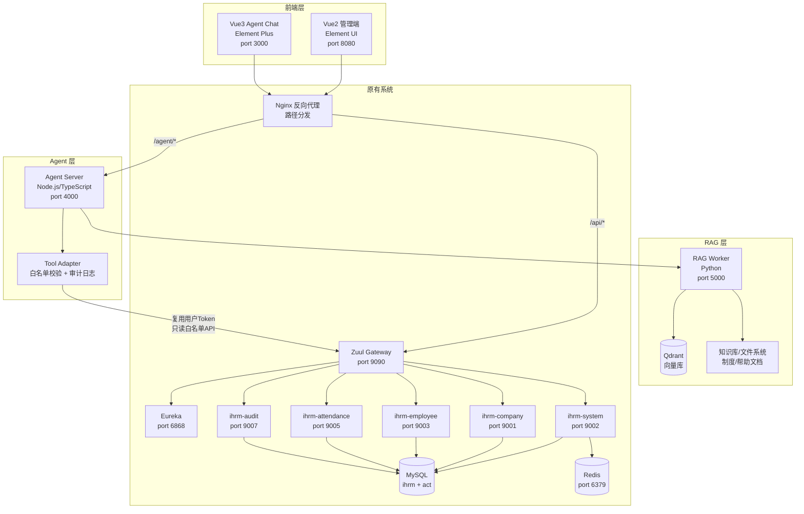

# Claude 交叉审计报告：SaaS HRM 架构、Agent 改造与 Vue3 迁移风险分析

> **审计人**: Claude Opus 4.6 (独立交叉审计)
> **审计日期**: 2026-06-25
> **审计范围**: `D:\Files\BaiDu\SaaS项目测试demo\_整理结果\` 下 day17 最终版全量源码
> **审计方式**: 静态源码分析（未实际执行启动命令）
> **对照报告**: Codex 生成《SaaS HRM 项目架构与数据库梳理报告》

---

## 1. 结论摘要

### 1.1 核心判断

| 判断项 | 结论 | 证据 |
|--------|------|------|
| 是否前后端分离 | **确认：是** | 前端 Vue SPA 通过 Axios + Proxy 调用后端 REST API，无 JSP/Thymeleaf 模板。证据：`客户端代码-day17最终版/config/index.js` proxyTable 配置、`src/utils/request.js` Axios baseURL |
| 后端是否 Maven 多模块 / Spring Cloud 微服务 | **确认：是** | 根 `pom.xml` 声明 11 个 `<module>`，Spring Boot 2.0.5 + Spring Cloud Finchley.SR1，Eureka + Zuul + Feign。证据：`服务端代码-day17最终版/pom.xml:10-22` |
| 前端是否 Vue2 + Element UI | **确认：是** | Vue 2.5.2 + Element UI 2.2.2 + Webpack 3.6.0。证据：`客户端代码-day17最终版/package.json` |
| 是否适合直接做 Agent 改造 | **不适合直接嵌入，适合旁路改造** | 权限系统极度薄弱（70+ 端点仅 1 个有 `@RequiresPermissions`），租户隔离存在漏洞（11 张敏感表缺 `company_id`），Agent 直接访问会放大安全风险 |
| 是否适合直接升级 Vue3 | **不适合整体升级，适合渐进式新建** | Webpack 3 → Vite 迁移成本大，Element UI 2 → Element Plus 组件不兼容，11 个模块耦合。建议新建 Vue3 独立页面（如 Agent Chat），逐步替换 |
| 是否适合 WSL2 部署调试 | **基本可行，但有风险点** | 所有后端配置指向 `127.0.0.1`，无 Windows 路径硬编码。风险：MySQL 5.5 驱动兼容、网关 Redis 指向 `127.0.0.2`（推测为笔误）、Activiti `act` 库脚本需单独导入 |
| 最大技术风险 | **权限形同虚设 + 租户隔离不完整** | 仅 `DELETE /sys/user/{id}` 有权限注解，薪资/社保/审批等高敏接口完全无保护。`sa_archive_detail`、`ss_archive_detail`、`ss_user_social_security` 等核心敏感表缺少 `company_id`，存在跨租户数据泄露风险 |
| 第一阶段最稳妥改造路线 | **旁路只读 Agent + 独立 Vue3 Chat 页面** | Agent Server 独立部署，通过 Zuul 网关调用只读 API，复用当前用户 Token，禁止一切写操作和直接 DB 访问 |

### 1.2 关键数字

| 指标 | 值 |
|------|-----|
| 后端模块数 | 11（含 2 个公共库） |
| 微服务数（可独立启动） | 9（Eureka + Gateway + 7 业务服务） |
| 数据库表数 | 51（ihrm 库）+ 25（act 库，Activiti 引擎） |
| Controller 数 | 18 |
| API 端点数 | ~75 |
| 有权限注解的端点 | 1 |
| 缺少 company_id 的敏感表 | 11 |
| 前端模块数 | 11 |
| 前端页面/组件估算 | ~80+ |

---

## 2. 对 Codex 报告的交叉验证

| Codex 结论 | Claude 验证结果 | 证据路径 | 是否一致 | 备注 |
|------------|----------------|----------|----------|------|
| day17 是最终主业务版本 | **确认一致** | `_解压结果/` 下 10+ 个 `ihrm_parent_*` 版本对比，day17 拥有最多模块（11 个），day14 仅 9 个 | ✅ 一致 | day17 新增 `ihrm_audit` 和 `ihrm_salarys` |
| Activiti7 目录是课程资料/示例 | **确认一致** | `_解压结果/Activiti7-day01~day07` 为独立工作流教学项目，含 holiday.bpmn 等示例，非 IHRM 生产代码 | ✅ 一致 | `ihrm_audit` 模块才是 IHRM 集成的 Activiti 工作流 |
| 后端模块列表（11 个） | **确认一致** | `服务端代码-day17最终版/pom.xml:10-22` 声明 11 个 module | ✅ 一致 | |
| 端口：Eureka 6868、Gate 9090、Company 9001、System 9002、Employee 9003、Social 9004、Attendance 9005、Salarys 9006、Audit 9007 | **确认一致** | 各服务 `application.yml` 中 `server.port` 配置 | ✅ 一致 | |
| Eureka 注册地址 `127.0.0.1:6868` | **确认一致** | 所有服务 `application.yml` 中 `eureka.client.service-url.defaultZone` | ✅ 一致 | |
| Zuul 路由 8 条 | **确认一致** | `ihrm_gate/src/main/resources/application.yml:26-78` 定义 8 条路由 | ✅ 一致 | 含 `/salarys/**`、`/company/**`、`/sys/**`、`/employees/**`、`/social_securitys/**`、`/cfg/**`、`/attendances/**`、`/user/**` |
| Feign 调用关系 | **确认一致** | system→company、audit→system、salarys→attendance、social→system/employee | ✅ 一致 | Feign 调用无认证头传递（Claude 补充发现） |
| Redis 配置 | **基本一致，发现差异** | 大部分服务 `redis.host: 127.0.0.1`，但 **Gateway 配置为 `127.0.0.2`** | ⚠️ 部分差异 | `ihrm_gate/application.yml:19` Redis host 为 `127.0.0.2`，Codex 未提及此差异，推测为配置笔误 |
| MySQL 连接 `127.0.0.1:3306/ihrm` | **确认一致** | 所有业务服务 datasource 配置一致。`ihrm_audit` 额外连接 `act` 库 | ✅ 一致 | 发现疑似敏感配置（数据库密码），路径：各服务 `application.yml` |
| 前端 Vue 2 + Element UI | **确认一致** | `package.json`: vue ^2.5.2, element-ui ^2.2.2, webpack ^3.6.0 | ✅ 一致 | |
| 数据库 51 张表 | **确认一致** | SQL 脚本含 51 个 `CREATE TABLE` 语句 | ✅ 一致 | Claude 逐表验证了全部 51 张表结构 |
| 表分组（co/bs/pe/em/atte/sa/ss/proc/sys/nots） | **确认一致** | SQL 前缀分组与 Codex 完全吻合 | ✅ 一致 | |
| 前端代理指向远程 `161.189.50.79` | **确认一致** | `config/index.js` proxyTable target | ✅ 一致 | |
| 刷脸登录前端封装存在但后端入口证据不足 | **确认一致，补充细节** | 前端 `src/api/base/faceLogin.js` 封装了 3 个 API。后端 `ihrm_system/ShiroConfiguration.java` 配置了 `/sys/faceLogin/**` 为 anon 过滤，但无对应 Controller 实现 | ✅ 一致 | 前端 login.vue 有完整的 QR 码轮询逻辑，后端实现缺失（推测 day11 功能未合并到 day17） |

### Claude 额外发现（Codex 未提及）

| 发现 | 严重程度 | 证据路径 |
|------|----------|----------|
| 网关 LoginFilter 被注释禁用 | 🔴 严重 | `ihrm_gate/src/main/java/com/ihrm/gate/filter/LoginFilter.java:14` `//@Component` |
| JwtInterceptor 被注释禁用 | 🔴 严重 | `ihrm_common/src/main/java/com/ihrm/common/interceptor/JwtInterceptor.java:34` `//@Component` |
| 70+ API 端点仅 1 个有权限注解 | 🔴 严重 | 仅 `DELETE /sys/user/{id}` 有 `@RequiresPermissions("API-USER-DELETE")` |
| 网关 Redis 地址为 127.0.0.2 | 🟡 中等 | `ihrm_gate/application.yml:19` |
| MD5 弱哈希（3 次迭代 + 手机号盐值） | 🟡 中等 | `UserController.java:252` `new Md5Hash(password, mobile, 3)` |
| Feign 服务间调用无认证传递 | 🟡 中等 | 所有 FeignClient 接口无 `@RequestHeader` 传递 Authorization |
| sa_archive_detail 等 3 张高敏表缺 company_id | 🔴 严重 | SQL 脚本中这些表的 CREATE TABLE 语句 |
| 前端 Dockerfile 存在 | 🟢 信息 | `客户端代码-day17最终版/Dockerfile` (基于 nginx) |
| 所有后端服务都有 Dockerfile | 🟢 信息 | 各模块根目录均有 Dockerfile (基于 java:8) |

---

## 3. 项目目录和模块关系复核

### 3.1 核心目录结构

```
_整理结果/                                    ← 改造基线目录
├── 服务端代码-day17最终版/                    ← 后端根目录
│   ├── pom.xml                              ← Maven 父 POM
│   ├── ihrm_eureka/                         ← Eureka 注册中心 (port 6868)
│   ├── ihrm_gate/                           ← Zuul 网关 (port 9090)
│   ├── ihrm_common/                         ← 公共工具库 (无端口)
│   ├── ihrm_common_model/                   ← 公共实体模型 (无端口)
│   ├── ihrm_company/                        ← 公司/部门服务 (port 9001)
│   ├── ihrm_system/                         ← 用户/权限服务 (port 9002)
│   ├── ihrm_employee/                       ← 员工管理服务 (port 9003)
│   ├── ihrm_social_securitys/               ← 社保服务 (port 9004)
│   ├── ihrm_attendance/                     ← 考勤服务 (port 9005)
│   ├── ihrm_salarys/                        ← 薪资服务 (port 9006)
│   └── ihrm_audit/                          ← 审批/工作流服务 (port 9007)
├── 客户端代码-day17最终版/                    ← 前端根目录
│   ├── package.json
│   ├── config/index.js                      ← 代理配置
│   ├── Dockerfile
│   └── src/
│       ├── router/index.js                  ← 路由入口
│       ├── store/index.js                   ← Vuex 根
│       ├── utils/request.js                 ← Axios 拦截器
│       ├── utils/auth.js                    ← Token 管理
│       ├── utils/permission.js              ← 权限检查
│       ├── api/base/                        ← 基础 API 封装
│       ├── api/hrm/                         ← 业务 API 封装
│       └── module-*/                        ← 11 个功能模块
├── 数据库脚本-ihrm-day17最终版.sql           ← 数据库脚本
├── docs/                                    ← 文档目录
└── 项目架构与数据库梳理报告.md               ← Codex 报告
```

### 3.2 后端启动类位置

| 服务 | 启动类路径 |
|------|-----------|
| Eureka | `ihrm_eureka/src/main/java/com/ihrm/eureka/EurekaServer.java` |
| Gateway | `ihrm_gate/src/main/java/com/ihrm/gate/GateApplication.java` |
| Company | `ihrm_company/src/main/java/com/ihrm/company/CompanyApplication.java` |
| System | `ihrm_system/src/main/java/com/ihrm/system/SystemApplication.java` |
| Employee | `ihrm_employee/src/main/java/com/ihrm/employee/EmployeeApplication.java` |
| Social Security | `ihrm_social_securitys/src/main/java/com/ihrm/social/SocialSecuritysApplication.java` |
| Attendance | `ihrm_attendance/src/main/java/com/ihrm/atte/AttandanceApplication.java` |
| Salarys | `ihrm_salarys/src/main/java/com/ihrm/salarys/SalarysApplication.java` |
| Audit | `ihrm_audit/src/main/java/com/ihrm/audit/AuditApplication.java` |

### 3.3 前端关键文件位置

| 类型 | 路径 |
|------|------|
| 路由配置 | `src/router/index.js` |
| Vuex 根 | `src/store/index.js` |
| 用户状态 | `src/module-dashboard/store/user.js` |
| 权限状态 | `src/module-dashboard/store/permission.js` |
| API 封装 | `src/api/base/` (系统级) + `src/api/hrm/` (业务级) |
| 登录页 | `src/module-dashboard/pages/login.vue` |
| Axios 拦截器 | `src/utils/request.js` |
| Token 管理 | `src/utils/auth.js` |

### 3.4 多版本冗余分析

| 目录 | 内容 | 是否冗余 | 建议 |
|------|------|---------|------|
| `_解压结果/ihrm_parent_*` (10+ 个) | day01-day17 各阶段后端快照 | 冗余 | 仅保留作历史参考，不作为改造基线 |
| `_解压结果/project-saas-hrm-vue-master_*` | 前端各阶段快照 | 冗余 | 与 `客户端代码-day17最终版` 内容基本一致 |
| `_解压结果/java后端代码_7ba365ab/` | day17 后端副本 | 重复 | 与 `服务端代码-day17最终版` 相同 |
| `_解压结果/Activiti7-day01~07/` | Activiti 课程材料 | 非生产代码 | 仅供学习参考 |
| `_解压结果/face-test_*` | 百度 AIP 人脸识别 PoC | 独立项目 | 未集成到 day17 最终版 |
| `_解压结果/codeutils_*` | 代码生成器课程工具 | 非生产代码 | 仅供参考 |
| `_解压结果/poi-demo_*` | POI Excel 课程示例 | 非生产代码 | POI 已集成到 ihrm_employee |
| `顺序排放/` | 完整课程材料（day01-17 + Activiti7） | 原始教学资料 | 不作为改造基线 |

**改造基线结论**：以 `_整理结果/` 下三个 day17 最终版为唯一权威基线。其他目录全部归档，不参与改造。

**旧版本混入风险**：低。`_整理结果/` 已独立提取，与 `_解压结果/` 物理隔离。但需注意 `_解压结果/java后端代码_7ba365ab/` 中存在一份 "ihrm_parent - 副本" 可能造成混淆。

---

## 4. WSL2 本地部署风险审计

> **声明：未实际执行，仅基于静态源码分析。**

### 4.1 推荐环境版本

| 组件 | 推荐版本 | 依据 |
|------|----------|------|
| JDK | **1.8 (OpenJDK 8)** | `pom.xml:38` `<java.version>1.8</java.version>` |
| Maven | **3.6.x** | Spring Boot 2.0.5 兼容范围 |
| Node.js | **10.x - 12.x** | Webpack 3.6.0 + node-sass 要求，>= 6.0.0（`package.json` engines） |
| npm | **>= 3.0.0** | `package.json` engines |
| MySQL | **5.7.x** | SQL 脚本声明 MySQL 5.5.58 导出，但建议用 5.7 保持兼容；MySQL 8.0 需额外调整驱动和 SQL 模式 |
| Redis | **4.x - 5.x** | shiro-redis 3.0.0 兼容范围 |

### 4.2 后端服务启动顺序

```
1. MySQL (导入 ihrm 库 + act 库)
2. Redis (port 6379)
3. ihrm_eureka (port 6868)           ← 必须先于所有业务服务
4. ihrm_company (port 9001)          ← 被其他服务 Feign 调用
5. ihrm_system (port 9002)           ← 登录入口，被多服务调用
6. ihrm_employee (port 9003)
7. ihrm_social_securitys (port 9004)
8. ihrm_attendance (port 9005)
9. ihrm_salarys (port 9006)
10. ihrm_audit (port 9007)           ← 依赖 act 库，需最后启动
11. ihrm_gate (port 9090)            ← 网关，所有服务注册后启动
```

### 4.3 服务配置详情

| 服务 | 端口 | 配置文件路径 | 数据库 | Redis |
|------|------|-------------|--------|-------|
| ihrm_eureka | 6868 | `ihrm_eureka/src/main/resources/application.yml` | 无 | 无 |
| ihrm_gate | 9090 | `ihrm_gate/src/main/resources/application.yml` | 无 | ⚠️ `127.0.0.2:6379` |
| ihrm_company | 9001 | `ihrm_company/src/main/resources/application.yml` | `ihrm` | `127.0.0.1:6379` |
| ihrm_system | 9002 | `ihrm_system/src/main/resources/application.yml` | `ihrm` | `127.0.0.1:6379` |
| ihrm_employee | 9003 | `ihrm_employee/src/main/resources/application.yml` | `ihrm` | `127.0.0.1:6379` |
| ihrm_social_securitys | 9004 | `ihrm_social_securitys/src/main/resources/application.yml` | `ihrm` | `127.0.0.1:6379` |
| ihrm_attendance | 9005 | `ihrm_attendance/src/main/resources/application.yml` | `ihrm` | `127.0.0.1:6379` |
| ihrm_salarys | 9006 | `ihrm_salarys/src/main/resources/application.yml` | `ihrm` | `127.0.0.1:6379` |
| ihrm_audit | 9007 | `ihrm_audit/src/main/resources/application.yml` | `ihrm` + `act` (双数据源) | `127.0.0.1:6379` |

### 4.4 部署风险清单

| 风险项 | 严重程度 | 位置 | 说明 |
|--------|----------|------|------|
| 网关 Redis 指向 `127.0.0.2` | 🟡 中 | `ihrm_gate/application.yml:19` | 推测为笔误，需改为 `127.0.0.1` |
| 前端代理指向远程 IP | 🟡 中 | `客户端代码/config/index.js` proxyTable target `161.189.50.79` | 本地调试需改为 `http://127.0.0.1:9090` |
| MySQL 驱动 `com.mysql.jdbc.Driver` 已废弃 | 🟡 中 | 所有服务 `application.yml` | MySQL 8.0 需改为 `com.mysql.cj.jdbc.Driver` |
| Activiti `act` 库脚本不在主 SQL 文件中 | 🟡 中 | `ihrm_audit/application.yml:9` 引用 `act` 库 | 需从 `顺序排放/IHRM项目/day16/03-资料/act.sql` 单独导入 |
| 考勤模块硬编码假期日期 | 🟢 低 | `ihrm_attendance/application.yml:34` `atte.holidays: 20191001...` | 2019 年假期数据，需按实际年份更新 |
| Windows 路径硬编码 | ✅ 未发现 | 全项目扫描 | 后端配置均使用相对路径或 URL |
| 远程 IP 硬编码（后端） | ✅ 未发现 | 后端配置全部指向 `127.0.0.1` | 仅前端代理有远程 IP |
| 七牛云 SDK 依赖 | 🟢 低 | `pom.xml:130-132` `qiniu-java-sdk [7.2.0, 7.2.99]` | 文件上传依赖七牛云，本地调试可能无法使用文件功能 |
| node-sass 编译问题 | 🟡 中 | `package.json` devDependencies sass-loader 6.0.7 | WSL2 上 node-sass 需要 Python 2.7 + build-essential |
| 数据库密码硬编码 | 🟡 中 | 各服务 `application.yml` | 发现疑似敏感配置，需按本地环境修改 |
| Dockerfile 使用 `java:8` 基础镜像 | 🟢 低 | 各服务 Dockerfile | 该镜像已废弃，建议改用 `openjdk:8-jre-slim` |
| HikariCP 连接池 maximum-pool-size: 2 | 🟢 低 | 各服务 datasource 配置 | 生产环境不足，本地调试可用 |

---

## 5. Controller/API 清单与 Agent Tool 候选

### 5.1 完整 API 端点清单

#### ihrm_system (端口 9002) — 用户/权限/登录

| Controller | 方法 | HTTP | URL 路径 | 读/写/删 | 权限注解 | 风险 |
|------------|------|------|----------|---------|----------|------|
| UserController | login | POST | `/sys/login` | 读 | anon | 低 |
| UserController | profile | POST | `/sys/profile` | 读 | 无 | 低 |
| UserController | findAll | GET | `/sys/user` | 读 | 无 | 中 |
| UserController | findById | GET | `/sys/user/{id}` | 读 | 无 | 中 |
| UserController | simple | GET | `/sys/user/simple` | 读 | 无 | 低 |
| UserController | save | POST | `/sys/user` | 写 | 无 | 高 |
| UserController | update | PUT | `/sys/user/{id}` | 写 | 无 | 高 |
| UserController | delete | DELETE | `/sys/user/{id}` | 删 | **@RequiresPermissions("API-USER-DELETE")** | 极高 |
| UserController | assignRoles | PUT | `/sys/user/assignRoles` | 写 | 无 | 极高 |
| UserController | upload | POST | `/sys/user/upload/{id}` | 写 | 无 | 高 |
| UserController | importUser | POST | `/sys/user/import` | 写 | 无 | 高 |
| RoleController | findByPage | GET | `/sys/role` | 读 | 无 | 低 |
| RoleController | findAll | GET | `/sys/role/list` | 读 | 无 | 低 |
| RoleController | findById | GET | `/sys/role/{id}` | 读 | 无 | 低 |
| RoleController | add | POST | `/sys/role` | 写 | 无 | 高 |
| RoleController | update | PUT | `/sys/role/{id}` | 写 | 无 | 高 |
| RoleController | delete | DELETE | `/sys/role/{id}` | 删 | 无 | 极高 |
| RoleController | assignPrem | PUT | `/sys/role/assignPrem` | 写 | 无 | 极高 |
| PermissionController | findAll | GET | `/sys/permission` | 读 | 无 | 中 |
| PermissionController | findById | GET | `/sys/permission/{id}` | 读 | 无 | 低 |
| PermissionController | save | POST | `/sys/permission` | 写 | 无 | 极高 |
| PermissionController | update | PUT | `/sys/permission/{id}` | 写 | 无 | 极高 |
| PermissionController | delete | DELETE | `/sys/permission/{id}` | 删 | 无 | 极高 |
| CityController | findAll | GET | `/sys/city` | 读 | 无 | 低 |
| CityController | findById | GET | `/sys/city/{id}` | 读 | 无 | 低 |
| CityController | save | POST | `/sys/city` | 写 | 无 | 低 |
| CityController | update | PUT | `/sys/city/{id}` | 写 | 无 | 低 |
| CityController | delete | DELETE | `/sys/city/{id}` | 删 | 无 | 低 |

#### ihrm_company (端口 9001) — 公司/部门

| Controller | 方法 | HTTP | URL 路径 | 读/写/删 | 权限注解 | 风险 |
|------------|------|------|----------|---------|----------|------|
| CompanyController | findAll | GET | `/company` | 读 | 无 | 中 |
| CompanyController | findById | GET | `/company/{id}` | 读 | 无 | 低 |
| CompanyController | save | POST | `/company` | 写 | 无 | 高 |
| CompanyController | update | PUT | `/company/{id}` | 写 | 无 | 高 |
| CompanyController | delete | DELETE | `/company/{id}` | 删 | 无 | 极高 |
| DepartmentController | findAll | GET | `/company/department` | 读 | 无 | 低 |
| DepartmentController | findById | GET | `/company/department/{id}` | 读 | 无 | 低 |
| DepartmentController | findByCode | POST | `/company/department/search` | 读 | 无 | 低 |
| DepartmentController | save | POST | `/company/department` | 写 | 无 | 中 |
| DepartmentController | update | PUT | `/company/department/{id}` | 写 | 无 | 中 |
| DepartmentController | delete | DELETE | `/company/department/{id}` | 删 | 无 | 高 |

#### ihrm_employee (端口 9003) — 员工管理

| Controller | 方法 | HTTP | URL 路径 | 读/写/删 | 权限注解 | 风险 |
|------------|------|------|----------|---------|----------|------|
| EmployeeController | findPersonalInfo | GET | `/employees/{id}/personalInfo` | 读 | 无 | 高（PII） |
| EmployeeController | savePersonalInfo | PUT | `/employees/{id}/personalInfo` | 写 | 无 | 高 |
| EmployeeController | findJobsInfo | GET | `/employees/{id}/jobs` | 读 | 无 | 中 |
| EmployeeController | saveJobsInfo | PUT | `/employees/{id}/jobs` | 写 | 无 | 高 |
| EmployeeController | findPositive | GET | `/employees/{id}/positive` | 读 | 无 | 中 |
| EmployeeController | savePositive | PUT | `/employees/{id}/positive` | 写 | 无 | 高 |
| EmployeeController | findLeave | GET | `/employees/{id}/leave` | 读 | 无 | 中 |
| EmployeeController | saveLeave | PUT | `/employees/{id}/leave` | 写 | 无 | 高 |
| EmployeeController | findTransferPosition | GET | `/employees/{id}/transferPosition` | 读 | 无 | 中 |
| EmployeeController | saveTransferPosition | PUT | `/employees/{id}/transferPosition` | 写 | 无 | 高 |
| EmployeeController | archives | GET | `/employees/archives` | 读 | 无 | 中 |
| EmployeeController | saveArchives | PUT | `/employees/archives/{month}` | 写 | 无 | 高 |
| EmployeeController | export | GET | `/employees/export/{month}` | 读 | 无 | 高（数据导出） |
| EmployeeController | pdf | GET | `/employees/{id}/pdf` | 读 | 无 | 高（PII 导出） |

#### ihrm_attendance (端口 9005) — 考勤

| Controller | 方法 | HTTP | URL 路径 | 读/写/删 | 权限注解 | 风险 |
|------------|------|------|----------|---------|----------|------|
| AttendanceController | importExcel(list) | GET | `/attendances` | 读 | 无 | 中 |
| AttendanceController | importExcel | POST | `/attendances/import` | 写 | 无 | 高 |
| AttendanceController | editAtte | PUT | `/attendances/{id}` | 写 | 无 | 中 |
| AttendanceController | reports | GET | `/attendances/reports` | 读 | 无 | 中 |
| AttendanceController | newReports | GET | `/attendances/newReports` | 写 | 无 | 中 |
| AttendanceController | findReportsByYear | GET | `/attendances/reports/year` | 读 | 无 | 低 |
| AttendanceController | findInfosById | GET | `/attendances/reports/{id}` | 读 | 无 | 中 |
| AttendanceController | historyData | GET | `/attendances/archive/{userId}/{yearMonth}` | 读 | 无 | 中 |
| AttendanceController | archives | GET | `/attendances/archives` | 写 | 无 | 高（归档） |
| ConfigController | atteConfig | POST | `/cfg/atte/item` | 读 | 无 | 低 |
| ConfigController | saveAtteConfig | PUT | `/cfg/atte` | 写 | 无 | 中 |
| ConfigController | leaveSaveOrUpdate | PUT | `/cfg/leave` | 写 | 无 | 中 |
| ConfigController | deductionSaveOrUpdate | PUT | `/cfg/deduction` | 写 | 无 | 高 |
| ConfigController | extDutySaveOrUpdate | PUT | `/cfg/extDuty` | 写 | 无 | 中 |
| ConfigController | leaveCfgItem | POST | `/cfg/leave/list` | 读 | 无 | 低 |
| ConfigController | dedCfgItem | POST | `/cfg/ded/list` | 读 | 无 | 低 |
| ConfigController | extWorkCfgItem | POST | `/cfg/extDuty/item` | 读 | 无 | 低 |

#### ihrm_salarys (端口 9006) — 薪资

| Controller | 方法 | HTTP | URL 路径 | 读/写/删 | 权限注解 | 风险 |
|------------|------|------|----------|---------|----------|------|
| SalaryController | modifyGet | GET | `/salarys/modify/{userId}` | 读 | 无 | 极高（薪资） |
| SalaryController | modify | POST | `/salarys/modify/{userId}` | 写 | 无 | 极高 |
| SalaryController | init | POST | `/salarys/init/{userId}` | 写 | 无 | 极高 |
| SalaryController | list | POST | `/salarys/list` | 读 | 无 | 极高（批量薪资） |
| ArchiveController | historyDetail | GET | `/salarys/reports/{yearMonth}` | 读 | 无 | 高 |
| SettingsController | getSettings | GET | `/salarys/settings` | 读 | 无 | 中 |
| SettingsController | saveSettings | POST | `/salarys/settings` | 写 | 无 | 高 |
| CompanySettingsController | getCompanySettings | GET | `/salarys/company-settings` | 读 | 无 | 中 |
| CompanySettingsController | saveCompanySettings | POST | `/salarys/company-settings` | 写 | 无 | 高 |
| CompanySettingsController | newReport | PUT | `/salarys/reports/{yearMonth}/newReport` | 写 | 无 | 高 |

#### ihrm_social_securitys (端口 9004) — 社保

| Controller | 方法 | HTTP | URL 路径 | 读/写/删 | 权限注解 | 风险 |
|------------|------|------|----------|---------|----------|------|
| SocialSecurityController | settings | GET | `/social_securitys/settings` | 读 | 无 | 中 |
| SocialSecurityController | saveSettings(report) | PUT | `/social_securitys/historys/{yearMonth}/newReport` | 写 | 无 | 高 |
| SocialSecurityController | saveSettings | POST | `/social_securitys/settings` | 写 | 无 | 高 |
| SocialSecurityController | list | POST | `/social_securitys/list` | 读 | 无 | 高（批量社保） |
| SocialSecurityController | findById | GET | `/social_securitys/{id}` | 读 | 无 | 高（PII+财务） |
| SocialSecurityController | saveUserSocialSecurity | PUT | `/social_securitys/{id}` | 写 | 无 | 极高 |
| SocialSecurityController | findPaymentItem | GET | `/social_securitys/payment_item/{id}` | 读 | 无 | 低 |
| SocialSecurityController | historysDetail | GET | `/social_securitys/historys/{yearMonth}` | 读 | 无 | 高 |
| SocialSecurityController | archive | POST | `/social_securitys/historys/{yearMonth}/archive` | 写 | 无 | 高（归档） |
| SocialSecurityController | historysList | GET | `/social_securitys/historys/{year}/list` | 读 | 无 | 中 |
| SocialSecurityController | historysData | GET | `/social_securitys/historys/archiveDetail/{userId}/{yearMonth}` | 读 | 无 | 高 |

#### ihrm_audit (端口 9007) — 审批/工作流

| Controller | 方法 | HTTP | URL 路径 | 读/写/删 | 权限注解 | 风险 |
|------------|------|------|----------|---------|----------|------|
| ProcessController | deployProcess | POST | `/user/process/deploy` | 写 | 无 | 极高 |
| ProcessController | definitionList | GET | `/user/process/definition` | 读 | 无 | 低 |
| ProcessController | suspendProcess | GET | `/user/process/suspend/{processKey}` | 写 | 无 | 极高 |
| ProcessController | instanceList | PUT | `/user/process/instance/{page}/{size}` | 读 | 无 | 中 |
| ProcessController | instanceDetail | GET | `/user/process/instance/{id}` | 读 | 无 | 中 |
| ProcessController | startProcess | POST | `/user/process/startProcess` | 写 | 无 | 高 |
| ProcessController | commit | PUT | `/user/process/instance/commit` | 写 | 无 | 极高（审批） |
| ProcessController | tasks | GET | `/user/process/instance/tasks/{id}` | 读 | 无 | 中 |

### 5.2 Agent Tool 候选表

| Tool 名称 | 业务模块 | 调用接口 | 读/写 | 风险等级 | 第一阶段开放 | 备注 |
|-----------|---------|---------|-------|---------|------------|------|
| query_departments | 组织架构 | GET `/company/department` | 读 | 低 | ✅ 是 | 公开组织信息 |
| query_department_detail | 组织架构 | GET `/company/department/{id}` | 读 | 低 | ✅ 是 | |
| query_user_list | 用户管理 | GET `/sys/user` | 读 | 中 | ✅ 是 | 需脱敏手机号 |
| query_user_simple | 用户管理 | GET `/sys/user/simple` | 读 | 低 | ✅ 是 | 简要信息 |
| query_my_profile | 个人信息 | POST `/sys/profile` | 读 | 低 | ✅ 是 | 仅查当前用户 |
| query_role_list | 权限管理 | GET `/sys/role/list` | 读 | 低 | ✅ 是 | |
| query_permission_list | 权限管理 | GET `/sys/permission` | 读 | 中 | ✅ 是 | 系统权限结构 |
| query_employee_jobs | 员工管理 | GET `/employees/{id}/jobs` | 读 | 中 | ✅ 是 | 需权限控制 |
| query_attendance_reports | 考勤 | GET `/attendances/reports` | 读 | 中 | ✅ 是 | |
| query_attendance_yearly | 考勤 | GET `/attendances/reports/year` | 读 | 低 | ✅ 是 | |
| query_process_definitions | 审批 | GET `/user/process/definition` | 读 | 低 | ✅ 是 | |
| query_process_instance | 审批 | GET `/user/process/instance/{id}` | 读 | 中 | ✅ 是 | |
| query_process_tasks | 审批 | GET `/user/process/instance/tasks/{id}` | 读 | 中 | ✅ 是 | |
| query_city_list | 基础数据 | GET `/sys/city` | 读 | 低 | ✅ 是 | |
| query_salary_detail | 薪资 | GET `/salarys/modify/{userId}` | 读 | 极高 | ❌ 否 | 第一阶段禁止 |
| query_salary_list | 薪资 | POST `/salarys/list` | 读 | 极高 | ❌ 否 | 批量薪资数据 |
| query_social_security | 社保 | GET `/social_securitys/{id}` | 读 | 高 | ❌ 否 | 含 PII+财务 |
| query_employee_personal | 员工 | GET `/employees/{id}/personalInfo` | 读 | 高 | ❌ 否 | 身份证/银行卡 |
| modify_salary | 薪资 | POST `/salarys/modify/{userId}` | 写 | 极高 | ❌ 否 | 禁止 |
| delete_user | 用户 | DELETE `/sys/user/{id}` | 删 | 极高 | ❌ 否 | 禁止 |
| assign_roles | 权限 | PUT `/sys/user/assignRoles` | 写 | 极高 | ❌ 否 | 禁止 |
| assign_permissions | 权限 | PUT `/sys/role/assignPrem` | 写 | 极高 | ❌ 否 | 禁止 |
| commit_approval | 审批 | PUT `/user/process/instance/commit` | 写 | 极高 | ❌ 否 | 禁止 |
| deploy_process | 审批 | POST `/user/process/deploy` | 写 | 极高 | ❌ 否 | 禁止 |
| modify_social_security | 社保 | PUT `/social_securitys/{id}` | 写 | 极高 | ❌ 否 | 禁止 |
| import_users | 用户 | POST `/sys/user/import` | 写 | 高 | ❌ 否 | 禁止 |
| upload_file | 文件 | POST `/sys/user/upload/{id}` | 写 | 高 | ❌ 否 | 禁止 |

---

## 6. JWT + Shiro + RBAC 权限链路审计

### 6.1 完整认证链路

```
[前端 login.vue]
    ↓ POST /sys/login {mobile, password}
    ↓ password = sha(password) → 前端哈希（证据不足，推测前端用 sha.js）
[Zuul Gateway :9090]
    ↓ 路由到 /sys/** → ihrm-system
    ↓ LoginFilter 已禁用（//@Component）→ 不做网关级认证
[ihrm_system :9002]
    ↓ ShiroConfiguration 配置 /sys/login → anon
    ↓ UserController.login()
    ↓ password = new Md5Hash(password, mobile, 3) → MD5 三次迭代
    ↓ subject.login(UsernamePasswordToken)
    ↓ → UserRealm.doGetAuthenticationInfo()
    ↓   → userService.findByMobile(mobile)
    ↓   → 比对密码
    ↓   → 构造 ProfileResult（含 roles.menus, roles.points, roles.apis）
    ↓ sessionId = subject.getSession().getId()
    ↓ 返回 sessionId 作为 Token
[前端 auth.js]
    ↓ Cookies.set('Admin-Token-HRM', sessionId)
    ↓ 后续请求 Authorization: Bearer {sessionId}
[后续请求链路]
    ↓ 前端 request.js → 附加 Authorization 头
    ↓ Zuul Gateway → 路由到目标服务
    ↓ 目标服务 CustomSessionManager → 从 Authorization 头提取 sessionId
    ↓ Shiro 通过 Redis 恢复 Session
    ↓ BaseController 从 Session 提取 companyId, userId
    ↓ 业务逻辑使用 companyId 过滤数据
```

### 6.2 关键组件位置

| 组件 | 文件路径 |
|------|---------|
| 登录接口 | `ihrm_system/.../controller/UserController.java` login() |
| Session 生成 | Shiro 内部，sessionId 由 `subject.getSession().getId()` 获取 |
| Session 管理器 | `ihrm_common/.../shiro/session/CustomSessionManager.java` |
| 基础 Realm | `ihrm_common/.../shiro/realm/IhrmRealm.java` |
| 用户 Realm | `ihrm_system/.../shiro/realm/UserRealm.java` |
| JWT 工具（未激活） | `ihrm_common/.../utils/JwtUtils.java` |
| JWT 拦截器（已禁用） | `ihrm_common/.../interceptor/JwtInterceptor.java` (`//@Component`) |
| 网关过滤器（已禁用） | `ihrm_gate/.../filter/LoginFilter.java` (`//@Component`) |
| 网关 Shiro 配置 | `ihrm_gate/.../ShiroConfiguration.java` |
| 各服务 Shiro 配置 | 每个服务模块下均有 `ShiroConfiguration.java` |

### 6.3 权限加载机制

```
UserRealm.doGetAuthenticationInfo():
  if user.level == "coAdmin":
    加载该公司所有角色的所有权限（menus + points + apis）
  else if user.level == "user":
    仅加载该用户所分配角色的权限
  
  ProfileResult 包含:
    roles.menus  → 前端菜单权限（路由级）
    roles.points → 前端按钮权限
    roles.apis   → 后端 API 权限字符串

IhrmRealm.doGetAuthorizationInfo():
  从 ProfileResult 中取出 roles.apis
  设置为 Shiro 的 StringPermissions
  → 仅在 @RequiresPermissions 注解时生效
```

### 6.4 权限体系致命问题

| 问题 | 严重程度 | 说明 |
|------|----------|------|
| 仅 1 个端点有 @RequiresPermissions | 🔴 致命 | 其余 70+ 端点只要登录即可访问 |
| 网关 LoginFilter 被禁用 | 🔴 致命 | 网关层不做任何认证检查 |
| JwtInterceptor 被禁用 | 🔴 致命 | JWT API 权限校验完全失效 |
| Feign 调用无认证传递 | 🔴 严重 | 服务间调用绕过所有权限检查 |
| 前端仅做菜单/按钮隐藏 | 🟡 中等 | 后端不校验 → 前端隐藏可被绕过 |
| MD5 弱哈希 | 🟡 中等 | 3 次迭代 + 手机号作为盐值 |

### 6.5 Agent 权限策略结论

| 策略项 | 结论 | 原因 |
|--------|------|------|
| Agent 是否复用当前用户 Token | **必须复用** | 确保 Agent 操作范围不超过用户自身权限 |
| Agent 是否必须走 Zuul 网关 | **必须** | 统一入口，便于审计和限流 |
| Agent 是否可直接访问微服务 | **禁止** | 绕过网关将绕过所有安全控制 |
| Agent 是否可直接查 MySQL | **第一阶段禁止** | 当前无行级安全，直连将导致跨租户泄露 |
| 必须禁止的场景 | 角色/权限修改、用户删除、薪资修改、社保修改、审批操作、流程部署/挂起 | 这些操作无后端权限保护，Agent 执行等同于无限制操作 |

---

## 7. 数据库字段级与租户隔离审计

### 7.1 核心表字段审计

| 表名 | 主键 | 有 company_id | 有 user_id | 状态字段 | 时间字段 | 软删除 | 适合 Agent 查询 | 需脱敏 | 第一阶段禁止 |
|------|------|:---:|:---:|------|------|:---:|:---:|:---:|:---:|
| co_company | id(varchar40) | — (自身) | ❌ | state | create_time | ❌ | ✅ | ❌ | ❌ |
| co_department | id(varchar40) | ✅ | ❌ | — | create_time | ❌ | ✅ | ❌ | ❌ |
| co_transaction_record | id(varchar40) | ✅ | ✅ | — | create_time | ❌ | ⚠️ | ❌ | ❌ |
| bs_user | id(varchar40) | ✅ | — (自身) | enable_state, in_service_status | create_time | ❌ | ✅ | ✅ 手机号 | ❌ |
| bs_permission | id(varchar40) | ✅ | ✅ | — | — | ❌ | ⚠️ | ❌ | ✅ |
| em_user_company | user_id(varchar40) | ✅ | ✅(PK) | state, in_service_status | — | ❌ | ✅ | ❌ | ❌ |
| em_user_company_personal | user_id(varchar40) | ✅ | ✅(PK) | — | — | ❌ | ⚠️ | ✅ 身份证/银行卡/手机 | ✅ |
| em_user_company_jobs | user_id(varchar40) | ✅ | ✅(PK) | — | — | ❌ | ✅ | ❌ | ❌ |
| **em_positive** | user_id(varchar40) | **❌ 缺失** | ✅(PK) | estatus | create_time | ❌ | ⚠️ | ❌ | ❌ |
| **em_resignation** | user_id(varchar40) | **❌ 缺失** | ✅(PK) | — | resignation_time, create_time | ❌ | ⚠️ | ❌ | ❌ |
| **em_transferposition** | user_id(varchar40) | **❌ 缺失** | ✅(PK) | estatus | adjustment_time, create_time | ❌ | ⚠️ | ❌ | ❌ |
| atte_attendance | id(varchar40) | ✅ | ✅ | adt_statu, job_statu | adt_in/out_time, create_date | ❌ | ✅ | ✅ 手机 | ❌ |
| **atte_archive_monthly_info** | id(varchar40) | **❌ 缺失** | ✅ | — | create_date, archive_date | ❌ | ⚠️ | ✅ 手机 | ❌ |
| **sa_user_salary** | user_id(varchar40) | **❌ 缺失** | ✅(PK) | — | — | ❌ | ❌ | ✅ 薪资 | ✅ |
| **sa_user_salary_change** | id(varchar40) | **❌ 缺失** | ✅ | — | effective_time | ❌ | ❌ | ✅ 薪资 | ✅ |
| **sa_archive_detail** | id(varchar40) | **❌ 缺失** | ✅ | — | — | ❌ | ❌ | ✅ 身份证/银行卡/薪资 | ✅ |
| **ss_user_social_security** | user_id(varchar40) | **❌ 缺失** | ✅(PK) | — | last_modify_time | ❌ | ❌ | ✅ 社保基数 | ✅ |
| **ss_archive_detail** | id(varchar40) | **❌ 缺失** | ✅ | — | — | ❌ | ❌ | ✅ 身份证/银行卡/社保 | ✅ |
| **proc_instance** | process_id(varchar45) | **❌ 缺失** | ✅ | process_state | proc_apply_time, proc_end_time | ❌ | ⚠️ | ❌ | ❌ |
| **proc_task_instance** | task_id(varchar45) | **❌ 缺失** | ✅ | handle_type | handle_time | ❌ | ⚠️ | ❌ | ❌ |
| pe_permission | id(varchar40) | ❌ (系统级) | ❌ | en_visible | — | ❌ | ✅ | ❌ | ❌ |
| pe_role | id(varchar40) | ✅ | ❌ | — | — | ❌ | ✅ | ❌ | ❌ |
| pe_user_role | (role_id, user_id) | ❌ (关联表) | ✅ | — | — | ❌ | ⚠️ | ❌ | ✅ |
| pe_role_permission | (role_id, permission_id) | ❌ (关联表) | ❌ | — | — | ❌ | ⚠️ | ❌ | ✅ |
| nots_notices | id(varchar40) | ✅ | ✅ | status | create_time, last_update_time | ❌ | ✅ | ❌ | ❌ |
| sys_file | id(varchar40) | ❌ | ❌ | — | create_time | ❌ | ⚠️ | ❌ | ❌ |

### 7.2 租户隔离风险总结

**缺少 company_id 的敏感表（跨租户泄露风险）**：

| 表 | 数据敏感度 | 泄露后果 | 紧急程度 |
|----|----------|---------|---------|
| sa_archive_detail | 极高（薪资+身份证+银行卡） | 全公司员工薪资可被任意租户查看 | 🔴 最高 |
| ss_archive_detail | 极高（社保+身份证+银行卡） | 全公司员工社保可被任意租户查看 | 🔴 最高 |
| ss_user_social_security | 高（社保基数/比例） | 员工社保配置跨租户可见 | 🔴 高 |
| sa_user_salary | 极高（基本工资） | 员工薪资跨租户可见 | 🔴 最高 |
| sa_user_salary_change | 高（调薪记录） | 调薪历史跨租户可见 | 🔴 高 |
| proc_instance | 中（审批内容） | 审批流程跨租户可见 | 🟡 中 |
| proc_task_instance | 中（审批任务） | 审批任务跨租户可见 | 🟡 中 |
| em_positive | 低（转正记录） | 转正信息跨租户可见 | 🟡 低 |
| em_resignation | 中（离职记录） | 离职信息跨租户可见 | 🟡 中 |
| em_transferposition | 中（调岗记录） | 调岗信息跨租户可见 | 🟡 中 |
| atte_archive_monthly_info | 中（考勤+手机） | 考勤明细跨租户可见 | 🟡 中 |

> **注意**：虽然 `BaseController` 从 Session 中提取 `companyId` 进行过滤，但这依赖于每个 DAO 查询都正确添加了 `company_id` 条件。对于缺少 `company_id` 字段的表，即使代码试图过滤也无法实现隔离。

---

## 8. 敏感数据分级与 Agent 安全策略

### 8.1 数据分级

| 数据类型 | 敏感等级 | 涉及表/字段 | 说明 |
|----------|---------|------------|------|
| 公司基础信息 | 🟢 低 | co_company.name/address/industry | 公开商业信息 |
| 部门结构 | 🟢 低 | co_department.name/code | 组织架构信息 |
| 员工姓名 | 🟡 中 | bs_user.username | 可与其他信息关联 |
| 员工手机号 | 🟠 高 | bs_user.mobile, em_user_company_personal.mobile | PII，唯一索引 |
| 身份证号 | 🔴 极高 | em_user_company_personal.id_number, sa/ss_archive_detail.id_number | 核心 PII |
| 护照号 | 🔴 极高 | em_user_company_personal.passport_no | 核心 PII |
| 住址 | 🟠 高 | em_user_company_personal.place_of_residence | PII |
| 岗位/职级 | 🟡 中 | em_user_company_jobs.post/rank | 职务信息 |
| 入职/离职时间 | 🟡 中 | bs_user.time_of_entry/time_of_dimission | 人事信息 |
| 考勤记录 | 🟡 中 | atte_attendance | 日常出勤 |
| 请假记录 | 🟡 中 | atte_archive_monthly_info.leave_days 等 | 休假信息 |
| 加班记录 | 🟡 中 | atte_extra_duty_* | 加班信息 |
| 薪资（基本工资） | 🔴 极高 | sa_user_salary.current_basic_salary | 核心财务 |
| 薪资（税前/税后/明细） | 🔴 极高 | sa_archive_detail.salary_before_tax/salary_after_tax 等 | 核心财务 |
| 社保基数/比例 | 🔴 极高 | ss_user_social_security.social_security_base | 核心财务 |
| 公积金账号 | 🔴 极高 | em_user_company_personal.provident_fund_account | 财务账号 |
| 银行卡号 | 🔴 极高 | em_user_company_personal.bank_card_number | 支付信息 |
| 社保电脑号 | 🔴 极高 | em_user_company_personal.social_security_computer_number | 政府 ID |
| 审批记录 | 🟡 中 | proc_instance/proc_task_instance | 业务流程 |
| 权限配置 | 🟠 高 | pe_role_permission, pe_user_role | 安全配置 |
| 登录账号/密码哈希 | 🔴 极高 | bs_user.mobile + bs_user.password | 认证凭证 |
| 文件上传记录 | 🟡 中 | sys_file | 文件元数据 |
| 身份证照片 | 🔴 极高 | em_user_company_personal.id_card_photo_positive/back | 证件影像 |

### 8.2 Agent 安全策略表

| 数据类型 | 敏感等级 | Agent 可查 | 是否脱敏 | 需强权限 | 需审计日志 |
|----------|---------|:---:|:---:|:---:|:---:|
| 公司信息 | 低 | ✅ | ❌ | ❌ | ❌ |
| 部门信息 | 低 | ✅ | ❌ | ❌ | ❌ |
| 员工姓名 | 中 | ✅ | ❌ | ❌ | ✅ |
| 手机号 | 高 | ✅ | ✅ 中间4位掩码 | ✅ | ✅ |
| 身份证 | 极高 | ❌ 第一阶段禁止 | ✅ 仅显示后4位 | ✅ | ✅ |
| 住址 | 高 | ❌ 第一阶段禁止 | ✅ | ✅ | ✅ |
| 岗位 | 中 | ✅ | ❌ | ❌ | ✅ |
| 入职/离职 | 中 | ✅ | ❌ | ❌ | ✅ |
| 考勤 | 中 | ✅ | ❌ | ✅ 仅查自己 | ✅ |
| 请假/加班 | 中 | ✅ | ❌ | ✅ 仅查自己 | ✅ |
| 薪资 | 极高 | ❌ 第一阶段禁止 | — | ✅ | ✅ |
| 社保 | 极高 | ❌ 第一阶段禁止 | — | ✅ | ✅ |
| 公积金 | 极高 | ❌ 第一阶段禁止 | — | ✅ | ✅ |
| 银行卡号 | 极高 | ❌ 永久禁止 | — | — | — |
| 审批记录 | 中 | ✅ | ❌ | ✅ 仅相关人 | ✅ |
| 权限配置 | 高 | ❌ 第一阶段禁止 | — | ✅ | ✅ |
| 登录凭证 | 极高 | ❌ 永久禁止 | — | — | — |
| 文件记录 | 中 | ✅ | ❌ | ✅ | ✅ |

---

## 9. Vue2 到 Vue3 渐进式迁移分析

### 9.1 前端技术栈现状

| 技术 | 版本 | Vue3 对应 | 迁移难度 |
|------|------|----------|---------|
| Vue | 2.5.2 | Vue 3.x | 高（Composition API、全局 API 变化） |
| Vue Router | 3.0.1 | Vue Router 4.x | 中（API 变化） |
| Vuex | 3.0.1 | Pinia | 中（推荐换 Pinia） |
| Element UI | 2.2.2 | Element Plus | 高（组件 API 大量变化） |
| Webpack | 3.6.0 | Vite | 高（构建工具完全替换） |
| Axios | 0.18.0 | Axios 1.x | 低 |
| ECharts | 3.8.5 | ECharts 5.x | 中 |
| xlsx | 0.14.4 | xlsx 最新版 | 低 |
| node-sass | (devDep) | sass (dart-sass) | 低 |

### 9.2 前端模块迁移评估

| 模块 | 页面路径 | 后端依赖 | 权限依赖 | 业务风险 | 迁移难度 | 第一阶段迁移 |
|------|---------|---------|---------|---------|---------|:---:|
| module-dashboard | login, dashboard, 404/401 | login API, profile API | 路由守卫 | 低 | 中 | ⚠️ 仅 Agent Chat |
| module-departments | 部门列表/树 | company 服务 | 菜单权限 | 低 | 低 | ✅ 可选 |
| module-users | 用户列表/详情 | system 服务 | 菜单+按钮 | 中 | 中 | ❌ |
| module-permissions | 权限/角色管理 | system 服务 | 管理员限定 | 高 | 中 | ❌ |
| module-employees | 员工档案/导入/导出/PDF | employee 服务 | 菜单+按钮 | 高 | 高（POI/PDF） | ❌ |
| module-attendances | 考勤列表/导入/报表 | attendance 服务 | 菜单权限 | 中 | 中 | ❌ |
| module-salarys | 薪资列表/设置/月报 | salarys 服务 | 菜单权限 | 极高 | 中 | ❌ |
| module-social-securitys | 社保列表/导入/月报 | social_securitys 服务 | 菜单权限 | 极高 | 中 | ❌ |
| module-approvals | 各类审批页面 | audit 服务 | 菜单权限 | 高 | 高（工作流） | ❌ |
| module-settings | 系统设置 | system 服务 | 管理员限定 | 中 | 低 | ❌ |
| module-saas-clients | SaaS 客户管理 | company 服务 | 超管限定 | 中 | 低 | ❌ |

### 9.3 迁移策略建议

**第一阶段建议 Vue3 重做的页面**：
- ✅ **Agent Chat 独立页面**（全新页面，不涉及旧组件迁移）
- ✅ **部门结构查看页面**（简单树形展示，低风险）

**不建议第一阶段迁移的页面**：
- ❌ 薪资管理（极高敏感度）
- ❌ 社保管理（极高敏感度）
- ❌ 审批流程（Activiti 复杂交互）
- ❌ 员工档案（PDF/Excel/文件上传依赖多）
- ❌ 权限管理（安全关键）

**必须保留旧系统的页面**：所有写操作页面（用户管理 CRUD、薪资修改、社保修改、审批操作）在第一阶段应保持 Vue2 运行。

**新旧共存方案**：
1. Vue3 新页面独立部署在 `/agent/` 路径下
2. Nginx 按路径分发：`/agent/*` → Vue3 应用，其余 → Vue2 应用
3. 共享同一 Cookie Token（`Admin-Token-HRM`），实现单点登录
4. Vue3 应用通过同一 Zuul 网关调用后端 API

---

## 10. Agent 改造目标架构设计

### 10.1 旁路 Agent 架构（Mermaid）



### 10.2 架构设计原则

| 原则 | 说明 |
|------|------|
| **旁路不侵入** | Agent Server 独立部署，不修改任何 Java 微服务代码 |
| **网关统一入口** | Agent 通过 Zuul 网关访问后端，不直连微服务 |
| **Token 透传** | Agent 复用当前登录用户的 Session Token，权限不超越用户本身 |
| **白名单控制** | Tool Adapter 维护可调用 API 白名单，拒绝非白名单请求 |
| **只读优先** | 第一阶段仅开放 GET 类查询接口 |
| **审计追踪** | 所有 Agent 调用记录写入独立审计日志 |
| **脱敏输出** | Agent 返回给用户的数据经过脱敏处理 |
| **禁止直连 DB** | Agent 不可直接访问 MySQL，所有数据必须通过 API 获取 |

### 10.3 技术栈推荐

| 组件 | 技术 | 理由 |
|------|------|------|
| Agent Server | Node.js + TypeScript | 异步 I/O 适合 Agent 编排，TypeScript 类型安全 |
| Agent Framework | Claude API / Anthropic SDK | 原生 Tool Use 支持 |
| Tool Adapter | Express middleware | 白名单校验 + 请求转发 + 审计日志 |
| RAG Worker | Python (FastAPI) | 成熟的 NLP/Embedding 生态 |
| 向量库 | Qdrant | 开源、轻量、支持过滤 |
| Embedding | text-embedding-3-small 或 BGE-M3 | 中文支持好 |
| Vue3 Chat UI | Vue 3 + Element Plus + Vite | 现代前端栈 |

---

## 11. 第一阶段 Agent MVP 范围

### 11.1 MVP 功能清单

| MVP 功能 | 依赖接口 | 需要权限 | 数据敏感度 | 是否脱敏 | 风险 | 推荐 |
|----------|---------|---------|-----------|:---:|------|:---:|
| 查询部门结构 | GET `/company/department` | 登录即可 | 低 | ❌ | 低 | ✅ |
| 查询部门详情 | GET `/company/department/{id}` | 登录即可 | 低 | ❌ | 低 | ✅ |
| 查询员工简要列表 | GET `/sys/user/simple` | 登录即可 | 低 | ❌ | 低 | ✅ |
| 查询当前用户信息 | POST `/sys/profile` | 登录即可 | 低 | ❌ | 低 | ✅ |
| 查询用户列表 | GET `/sys/user` | 登录即可 | 中 | ✅ 手机号 | 中 | ✅ |
| 查询角色列表 | GET `/sys/role/list` | 登录即可 | 低 | ❌ | 低 | ✅ |
| 查询权限树 | GET `/sys/permission` | 登录即可 | 中 | ❌ | 低 | ✅ |
| 查询员工岗位信息 | GET `/employees/{id}/jobs` | 需 HR 权限 | 中 | ❌ | 中 | ✅ |
| 查询考勤年度报表 | GET `/attendances/reports/year` | 登录即可 | 低 | ❌ | 低 | ✅ |
| 查询考勤月度报表 | GET `/attendances/reports` | 登录即可 | 中 | ❌ | 中 | ✅ |
| 查询审批流程定义 | GET `/user/process/definition` | 登录即可 | 低 | ❌ | 低 | ✅ |
| 查询审批实例详情 | GET `/user/process/instance/{id}` | 相关人 | 中 | ❌ | 中 | ✅ |
| 查询审批任务 | GET `/user/process/instance/tasks/{id}` | 相关人 | 中 | ❌ | 中 | ✅ |
| 查询城市列表 | GET `/sys/city` | 公开 | 低 | ❌ | 低 | ✅ |
| 根据数据生成摘要/草稿 | Agent 内部 LLM 调用 | — | — | — | 低 | ✅ |
| 查询制度/帮助文档 | RAG Worker 本地向量检索 | — | — | — | 低 | ✅ |

### 11.2 MVP 禁止事项

| 禁止操作 | 原因 |
|----------|------|
| 删除用户 | 不可逆操作，无软删除 |
| 修改权限/角色 | 安全关键操作 |
| 修改薪资 | 极高敏感度 |
| 修改社保 | 极高敏感度 |
| 自动审批 | 业务决策不可自动化 |
| 自动发通知 | 需人工确认 |
| 直接写数据库 | 绕过所有安全控制 |
| 跨租户查询 | 当前隔离机制不完整 |
| 查询身份证/银行卡 | PII 极高风险 |
| 查询薪资明细 | 极高敏感度 |
| 文件上传 | 安全风险 |
| 数据导入 | 批量写操作 |

---

## 12. 风险清单和优先级

| 风险 | 等级 | 证据路径 | 影响 | 建议 |
|------|------|---------|------|------|
| 权限注解几乎缺失（1/75） | 🔴 极高 | 全部 Controller 文件扫描，仅 `UserController.java` 的 delete 方法有注解 | 任何登录用户可访问所有 API | Agent 改造前必须补全后端权限校验，或在 Tool Adapter 层强制白名单 |
| 网关 LoginFilter 被禁用 | 🔴 极高 | `ihrm_gate/filter/LoginFilter.java:14` `//@Component` | 网关不做任何认证，所有请求直接转发 | 启用网关认证或在 Agent Adapter 层补偿 |
| 薪资/社保表缺 company_id | 🔴 极高 | `sa_archive_detail`, `ss_archive_detail`, `sa_user_salary` 等表 CREATE 语句 | 跨租户薪资/社保数据泄露 | 第一阶段 Agent 完全禁止访问这些表的 API |
| MD5 弱密码哈希 | 🟡 中 | `UserController.java:252` `Md5Hash(password, mobile, 3)` | 密码可被彩虹表攻击 | 中期迁移到 BCrypt |
| Spring Cloud Finchley.SR1 (2018) | 🟡 中 | `pom.xml:47` | 已 EOL，无安全补丁 | 长期需升级到 Spring Cloud 2021.x+ |
| Java 8 + Spring Boot 2.0.5 | 🟡 中 | `pom.xml:31,38` | Java 8 公开维护已结束，Spring Boot 2.0 已 EOL | 长期需升级到 Java 17 + Spring Boot 3.x |
| Zuul 1.x（维护模式） | 🟡 中 | `ihrm_gate` 使用 Netflix Zuul | Netflix Zuul 已停止开发 | 长期迁移到 Spring Cloud Gateway |
| Maven 依赖可能下载失败 | 🟡 中 | `pom.xml` 多个旧版本依赖 | 部分旧版 jar 可能从中央仓库下架 | 配置阿里云 Maven 镜像 |
| MySQL 版本兼容 | 🟡 中 | 所有 `application.yml` 使用 `com.mysql.jdbc.Driver` | MySQL 8.0 需改驱动类名 + 时区配置 | 推荐 MySQL 5.7 或修改配置 |
| Redis 必要性 | 🟢 低 | 所有服务都配置了 Redis | Redis 用于 Shiro Session + 权限缓存，必须运行 | 确保 WSL2 启动 Redis |
| Activiti7 集成（act 库） | 🟡 中 | `ihrm_audit/application.yml:8-17` 双数据源 | act 库脚本不在主 SQL 中，需单独创建 | 从 day16 资料导入 act.sql |
| 前端 Webpack 3 + Vue 2 | 🟡 中 | `package.json` | 无法使用现代前端生态 | 渐进式新建 Vue3 页面 |
| 前端远程 API 硬编码 | 🟡 中 | `config/index.js` proxyTable target `161.189.50.79` | 本地开发无法直接使用 | 修改为本地网关地址 |
| node-sass 编译问题 | 🟡 中 | `package.json` devDependencies | WSL2 编译 node-sass 需额外依赖 | 考虑替换为 dart-sass |
| 刷脸登录后端缺失 | 🟢 低 | 前端 `faceLogin.js` 有封装，后端 ShiroConfig 有 anon 配置但无 Controller | 功能不可用 | 暂不影响核心业务 |
| Agent 幻觉导致误操作 | 🔴 高 | Agent 天然风险 | Agent 可能生成错误的查询条件或误导用户 | 第一阶段仅只读，所有 Agent 输出标注 "AI 生成，仅供参考" |
| 敏感数据泄露 | 🔴 高 | `em_user_company_personal` 表含身份证/银行卡/社保号 | PII 泄露法律风险 | 强制脱敏 + 审计日志 + 白名单控制 |
| Docker/WSL2 路径兼容 | 🟢 低 | 后端 Dockerfile 使用 `java:8` 基础镜像 | 镜像已废弃 | 改用 `openjdk:8-jre-slim` |
| Feign 服务间无认证 | 🟡 中 | 所有 FeignClient 无 `@RequestHeader` 传递 Token | 内部服务可被无认证调用 | 评估是否需要服务间鉴权 |
| 全局 `@CrossOrigin` | 🟡 中 | 部分 Controller 标注 `@CrossOrigin` | CORS 开放可能导致 CSRF | 统一在网关配置 CORS 白名单 |

---

## 13. 最终建议路线图

### Phase 0：代码冻结与基线确认

| 项目 | 内容 |
|------|------|
| **目标** | 确认改造基线，冻结 day17 最终版代码，归档冗余版本 |
| **输入** | `_整理结果/` 下三个 day17 最终版目录 |
| **输出** | Git 仓库初始化、`.gitignore` 配置、基线 tag、归档清单 |
| **不做什么** | 不修改任何代码、不删除历史版本 |
| **验收标准** | `_整理结果/服务端代码-day17最终版` 和 `客户端代码-day17最终版` 已入 Git，打 `baseline-day17` tag；冗余版本移至 `_archive/` |

### Phase 1：WSL2 本地启动验证

| 项目 | 内容 |
|------|------|
| **目标** | 在 WSL2 Ubuntu 中成功启动全部 9 个服务 + 前端 |
| **输入** | Phase 0 的 Git 仓库、MySQL 5.7、Redis、JDK 8、Maven、Node 10-12 |
| **输出** | 启动脚本（start-all.sh）、配置调整记录、前端可访问截图 |
| **不做什么** | 不修改业务逻辑、不升级框架版本 |
| **验收标准** | 浏览器打开 `localhost:8080` 可登录、查看部门列表、查看员工列表；9 个服务全部注册到 Eureka |

**需修改的配置**：
1. `ihrm_gate/application.yml` Redis host 改为 `127.0.0.1`
2. `config/index.js` proxyTable target 改为 `http://127.0.0.1:9090`
3. 各服务数据库密码按本地环境调整
4. 导入 `ihrm` 库（主 SQL）+ `act` 库（day16 资料）

### Phase 2：API/RBAC/数据库审计补全

| 项目 | 内容 |
|------|------|
| **目标** | 补全本报告中发现的安全缺陷，为 Agent 接入做准备 |
| **输入** | Phase 1 可运行的系统 + 本报告风险清单 |
| **输出** | 补全权限注解的 Controller、启用网关认证、API 白名单文档 |
| **不做什么** | 不做大规模重构、不升级框架、不改变业务逻辑 |
| **验收标准** | 所有高风险端点（薪资/社保/权限/审批）有权限注解；网关 LoginFilter 启用或等效方案上线；编写 Agent 可调用 API 白名单 |

### Phase 3：只读 Agent MVP

| 项目 | 内容 |
|------|------|
| **目标** | 部署旁路 Agent Server，实现 11.1 中的 MVP 功能 |
| **输入** | Phase 2 的安全加固系统 + API 白名单 |
| **输出** | Agent Server (Node.js)、Tool Adapter、Vue3 Chat UI、RAG Worker |
| **不做什么** | 不开放任何写操作、不直连数据库、不接触薪资/社保/权限数据 |
| **验收标准** | 用户在 Agent Chat 中可查询部门结构、员工列表、考勤摘要、审批状态；所有查询经过 Token 校验和白名单过滤；审计日志完整记录 |

### Phase 4：Agent Tool 白名单与审计日志

| 项目 | 内容 |
|------|------|
| **目标** | 完善 Agent 安全控制，建立审计体系 |
| **输入** | Phase 3 运行中的 Agent MVP |
| **输出** | Tool 白名单管理界面、审计日志查询界面、异常检测告警 |
| **不做什么** | 不扩大 API 访问范围、不开放高敏数据 |
| **验收标准** | 管理员可配置 Agent Tool 白名单；所有 Agent 调用有完整审计记录；异常调用（频率异常、非白名单请求）触发告警 |

### Phase 5：Vue3 独立新页面迁移

| 项目 | 内容 |
|------|------|
| **目标** | 用 Vue3 + Element Plus + Vite 重做低风险页面 |
| **输入** | Vue2 现有页面、后端 API 不变 |
| **输出** | Vue3 独立应用（部门查看、组织架构、个人中心） |
| **不做什么** | 不迁移高敏页面（薪资/社保/权限）、不修改后端 API |
| **验收标准** | Vue3 页面与 Vue2 通过 Nginx 路径分发共存；共享登录 Token；新页面功能与旧页面一致 |

### Phase 6：逐步开放低风险写操作

| 项目 | 内容 |
|------|------|
| **目标** | Agent 支持部分低风险写操作（需人工确认） |
| **输入** | Phase 4 完善的审计系统 |
| **输出** | Agent 可辅助填写表单草稿、发起请假/加班申请（需用户确认） |
| **不做什么** | 不自动审批、不修改薪资/社保/权限、不删除数据 |
| **验收标准** | Agent 生成的操作草稿需用户手动确认才执行；写操作审计日志完整；回滚机制就绪 |

### Phase 7：高风险模块人工确认流

| 项目 | 内容 |
|------|------|
| **目标** | 为薪资查询、社保查询等高敏操作建立人工确认机制 |
| **输入** | Phase 6 的 Agent 写能力 + 成熟的审计系统 |
| **输出** | 双人确认流程、敏感数据脱敏查看、操作审批链 |
| **不做什么** | 不允许 Agent 直接修改薪资/社保/权限 |
| **验收标准** | 薪资/社保数据查询需二次确认（MFA 或审批）；所有敏感数据输出强制脱敏；完整审计链可追溯 |

---

## 附录：Claude 与 Codex 结论差异摘要

| 主题 | Codex 结论 | Claude 结论 | 差异说明 |
|------|-----------|------------|---------|
| 总体架构 | 前后端分离、Spring Cloud 微服务 | **一致** | 无差异 |
| 模块数 | 11 个 | **一致** | 无差异 |
| 端口配置 | 6868/9090/9001-9007 | **一致** | 无差异 |
| 数据库表数 | 51 张 | **一致** | 无差异 |
| 前端技术栈 | Vue 2 + Element UI | **一致** | 无差异 |
| Redis 配置 | 未特别提及网关差异 | **发现差异**：网关 Redis 为 `127.0.0.2` | Claude 补充发现 |
| 权限保护程度 | 提及 JWT + Shiro | **补充**：实际仅 1 个端点有注解，LoginFilter 和 JwtInterceptor 均被禁用 | Claude 深度发现 |
| 租户隔离 | 提及 company_id | **补充**：11 张敏感表缺少 company_id，存在跨租户泄露 | Claude 逐表验证发现 |
| Feign 调用安全 | 提及调用关系 | **补充**：Feign 调用无认证头传递 | Claude 深度发现 |
| 刷脸登录 | 前端封装存在但后端入口证据不足 | **一致，补充**：ShiroConfig 有 anon 配置但无 Controller | 细节补充 |
| 密码安全 | 未特别分析 | **补充**：MD5 + 手机号盐值 + 3 次迭代，强度不足 | Claude 新发现 |
| day17 为最终版 | 确认 | **确认一致** | 无差异 |
| Activiti7 为课程资料 | 确认 | **确认一致** | 无差异 |

**总结**：Codex 报告在架构概览、模块列表、端口配置、表结构等"是什么"层面准确率高。Claude 交叉审计在安全链路、权限实现细节、租户隔离字段级检查、配置差异等"怎么样"和"有什么风险"层面补充了大量 Codex 未覆盖的深度发现。两份报告互补使用可提供更完整的工程决策依据。

---

> **免责声明**：本报告基于静态源码分析，未实际执行编译和运行。所有标注"推测"的结论需运行验证后确认。报告中未展示任何密码、Token、AccessKey 等敏感配置原文。发现疑似敏感配置的位置已标注文件路径。
