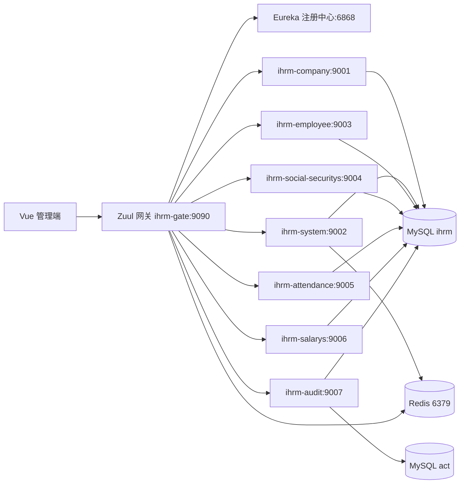
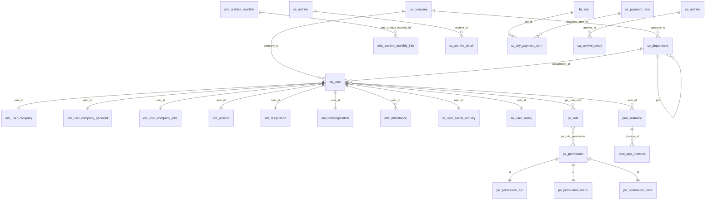

# SaaS HRM 项目架构与数据库梳理报告

## 1. 整理结果

原始目录：`D:\Files\BaiDu\SaaS项目测试demo`

已生成两个工作目录：

- `_解压结果`：统一存放解压后的压缩包内容，并生成清单。
  - `解压清单.csv`：39 个 zip 解压记录。
  - `rar解压清单.csv`：8 个 rar 解压记录，包含 zip 解压后发现的嵌套 rar。
- `_整理结果`：提取最终版项目代码和数据库脚本。
  - `服务端代码-day17最终版`：最终后端代码，约 715 个文件、13 MB。
  - `客户端代码-day17最终版`：最终前端代码，约 322 个文件、2.45 MB。
  - `数据库脚本-ihrm-day17最终版.sql`：最终业务库脚本。

说明：IHRM 项目按 day01 到 day17 分阶段提供源码，最终版本位于 day17。本报告以 day17 代码为主；Activiti7 目录是工作流课程资料和示例，不作为 IHRM 主业务系统代码。

## 2. 总体架构

项目是一个前后端分离的 SaaS HRM 系统：

- 前端：Vue 2 + Element UI + Vue Router + Vuex + Axios + Webpack 3。
- 后端：Java 8 + Spring Boot 2.0.5 + Spring Cloud Finchley.SR1。
- 服务治理：Eureka 注册中心。
- 网关：Zuul API Gateway。
- 服务通信：OpenFeign。
- 数据访问：Spring Data JPA + MySQL。
- 认证授权：JWT + Shiro，Redis 用于会话/权限相关缓存。
- 工作流：Activiti 7，使用独立 `act` 工作流库，同时在 `ihrm` 库保存业务流程实例。
- 文档/文件能力：POI Excel 导入导出、JasperReports PDF 报表、七牛云上传工具。
- 部署痕迹：后端多个业务服务带 Dockerfile。

整体访问路径：

## 3. 后端服务模块

最终后端是 Maven 多模块项目，根模块 `ihrm_parent` 聚合以下模块：

| 模块 | 端口 | 作用 |
|---|---:|---|
| `ihrm_eureka` | 6868 | Eureka 注册中心 |
| `ihrm_gate` | 9090 | Zuul 网关，统一入口和路由 |
| `ihrm_common` | - | 通用工具、JWT、Shiro Realm、POI、文件工具、统一响应等 |
| `ihrm_common_model` | - | 跨模块共享实体、VO、BO、响应对象 |
| `ihrm_company` | 9001 | 公司、部门、企业组织架构 |
| `ihrm_system` | 9002 | 用户、角色、权限、城市、登录、资料、用户导入 |
| `ihrm_employee` | 9003 | 员工档案、岗位信息、转正、离职、调岗、PDF/Excel |
| `ihrm_social_securitys` | 9004 | 社保配置、缴费项、员工社保、社保归档/月报 |
| `ihrm_attendance` | 9005 | 考勤配置、考勤导入、报表、归档 |
| `ihrm_salarys` | 9006 | 薪资配置、员工薪资、调薪、工资归档/月报 |
| `ihrm_audit` | 9007 | Activiti 审批流程、流程部署、流程实例、任务审批 |

网关路由主要包括：

| 路径 | 服务 |
|---|---|
| `/company/**` | `ihrm-company` |
| `/sys/**` | `ihrm-system` |
| `/employees/**` | `ihrm-employee` |
| `/social_securitys/**` | `ihrm-social-securitys` |
| `/cfg/**` | `ihrm-attendance` |
| `/attendances/**` | `ihrm-attendance` |
| `/salarys/**` | `ihrm-salarys` |
| `/user/**` | `ihrm-audit` |

服务间 Feign 调用关系：

- `ihrm_system` 调用 `ihrm_company` 获取部门信息。
- `ihrm_social_securitys` 调用 `ihrm_employee` 和 `ihrm_system`。
- `ihrm_salarys` 调用 `ihrm_attendance` 和 `ihrm_social-securitys`。
- `ihrm_audit` 调用 `ihrm_system` 获取用户/组织相关数据。

## 4. 前端结构

最终前端是 Vue 2 管理端，入口在 `客户端代码-day17最终版`。

核心依赖：`vue`、`vue-router`、`vuex`、`axios`、`element-ui`、`echarts`、`xlsx`、`file-saver`、`nprogress`。

主要模块：

| 前端模块 | 页面/功能 |
|---|---|
| `module-dashboard` | 登录、注册、仪表盘、错误页、布局、刷脸登录页面 |
| `module-saas-clients` | SaaS 企业/客户列表、详情 |
| `module-departments` | 部门管理 |
| `module-users` | 用户、我的信息、审批入口、招聘/公告详情 |
| `module-permissions` | 权限管理 |
| `module-employees` | 员工列表、员工详情、调岗、离职、归档、报表、导入、打印 |
| `module-attendances` | 考勤列表、历史归档、考勤报表 |
| `module-social-securitys` | 社保列表、详情、导入、月报、历史归档 |
| `module-salarys` | 薪资列表、详情、设置、月报、历史归档 |
| `module-approvals` | 入职、请假、加班、离职、调薪、社保审批等 |
| `module-settings` | 系统设置 |

前端配置里 `BASE_API` 是 `api`，开发代理当前指向 `http://161.189.50.79/api`。如果本地联调，通常需要把代理目标改成网关地址，例如 `http://127.0.0.1:9090` 或本地 Nginx/API 代理地址。

注意：前端保留了 `/sys/faceLogin/qrcode`、`/sys/faceLogin/checkFace` 等刷脸登录 API 封装，但 day17 最终后端未明显看到对应控制器入口，可能是 day11 课程版本功能没有完整合并到最终后端。

## 5. 数据库结构

最终业务库脚本：`数据库脚本-ihrm-day17最终版.sql`。

- 业务库 `ihrm`：51 张表。
- 工作流库 `act`：25 张 Activiti 引擎表，脚本在 day16 资料里，`ihrm_audit` 配置同时连接 `act` 和 `ihrm`。
- SQL 中基本没有显式 `FOREIGN KEY` 约束，关系主要依赖字段命名和代码逻辑维护。

### 5.1 业务表分组

| 前缀 | 表 | 业务域 |
|---|---|---|
| `co_*` | `co_company`, `co_department`, `co_transaction_record` | 公司、部门、企业交易记录 |
| `bs_*` | `bs_city`, `bs_month`, `bs_permission`, `bs_user` | 基础数据、用户 |
| `pe_*` | `pe_permission`, `pe_permission_api`, `pe_permission_menu`, `pe_permission_point`, `pe_role`, `pe_role_permission`, `pe_user_role` | 权限/RBAC |
| `em_*` | `em_archive`, `em_positive`, `em_resignation`, `em_transferposition`, `em_user_company`, `em_user_company_jobs`, `em_user_company_personal` | 员工档案与人事变动 |
| `atte_*` | `atte_attendance`, `atte_attendance_config`, `atte_company_settings`, `atte_day_off_config`, `atte_deduction_dict`, `atte_deduction_type`, `atte_extra_duty_config`, `atte_extra_duty_rule`, `atte_leave_config`, `atte_archive_monthly`, `atte_archive_monthly_info` | 考勤、考勤设置、考勤归档 |
| `ss_*` | `ss_user_social_security`, `ss_company_settings`, `ss_payment_item`, `ss_city_payment_item`, `ss_archive`, `ss_archive_detail` | 社保、公积金、社保归档 |
| `sa_*` | `sa_user_salary`, `sa_user_salary_change`, `sa_settings`, `sa_company_settings`, `sa_archive`, `sa_archive_detail` | 薪资、调薪、工资归档 |
| `proc_*` | `proc_instance`, `proc_task_instance`, `proc_user_group` | 业务审批流程记录 |
| `sys_*` | `sys_file`, `sys_mail_record`, `sys_settings` | 系统文件、邮件、系统设置 |
| `nots_*` | `nots_notices` | 公告/通知 |

### 5.2 核心关系

关系说明：

- `co_company` 是 SaaS 租户/企业维度，许多表都有 `company_id`。
- `co_department` 通过 `pid` 形成部门树，同时被用户、员工、考勤等模块引用。
- `bs_user` 是系统用户/员工基础身份，员工扩展信息拆到 `em_*` 表。
- `pe_user_role` 连接用户和角色，`pe_role_permission` 连接角色和权限，是 RBAC 的核心多对多关系。
- `pe_permission` 是权限主表，`pe_permission_api/menu/point` 是 API、菜单、按钮/点权限的扩展表。
- 考勤、社保、薪资都有“当前数据 + 设置 + 归档 + 归档明细”的结构。
- `proc_instance` 和 `proc_task_instance` 保存业务审批实例/任务；Activiti 自身运行态、历史态数据在 `act_*` 表中。

## 6. 已实现功能

从前端模块、后端控制器、DAO/实体和数据库表综合判断，项目实现了这些功能：

1. SaaS 企业/客户管理：企业列表、详情、企业基础信息。
2. 组织架构管理：公司、部门 CRUD、部门树。
3. 用户管理：用户增删改查、分页、导入、上传头像/资料、用户基础信息查询。
4. 登录与权限：登录、JWT、Shiro 授权、角色分配、权限分配、API/菜单/按钮权限。
5. 员工管理：员工档案、个人信息、岗位信息、转正、离职、调岗、归档、员工报表、PDF 打印、Excel 导入导出。
6. 考勤管理：考勤配置、请假/加班/扣款配置、考勤数据导入、考勤报表、历史归档。
7. 社保管理：企业社保设置、缴费项、城市缴费项、员工社保信息、社保报表、历史归档、导入。
8. 薪资管理：薪资设置、员工薪资初始化、调薪、工资列表/详情、月报、历史归档。
9. 审批/工作流：流程部署、流程定义查询、流程启动、流程实例列表/详情、任务列表、提交审批、挂起流程；前端有入职、请假、加班、离职、调薪、社保相关审批页面。
10. 公告/通知、招聘相关页面：前端存在公告详情、招聘和招聘详情页面，后端有 `nots_notices` 表和 notices API 封装。
11. 文件和报表能力：POI Excel、Jasper PDF、七牛上传工具类。
12. 网关和微服务治理：Eureka 注册、Zuul 路由、Feign 服务调用、Dockerfile 部署入口。

## 7. 启动/联调建议

推荐顺序：

1. 准备 MySQL，导入 `ihrm` 库脚本；审批模块还需要 `act` 库及 Activiti 表。
2. 启动 Redis，默认端口 6379。
3. 启动 `ihrm_eureka`。
4. 启动业务服务：`ihrm_company`、`ihrm_system`、`ihrm_employee`、`ihrm_attendance`、`ihrm_social_securitys`、`ihrm_salarys`、`ihrm_audit`。
5. 启动 `ihrm_gate`。
6. 启动前端，并把前端代理目标改成本地网关地址。

需要注意：

- 后端配置使用本地 MySQL `127.0.0.1:3306`，用户名多为 `root`；密码需要按本地环境调整。
- `ihrm_audit` 使用两个数据源：`act` 和 `ihrm`。
- 前端配置当前代理到远程 API，做本地测试前应修改。
- 根 `pom.xml` 中有历史编码/注释问题，IDE 通常能打开，但标准 XML 解析工具可能报注释格式问题。
