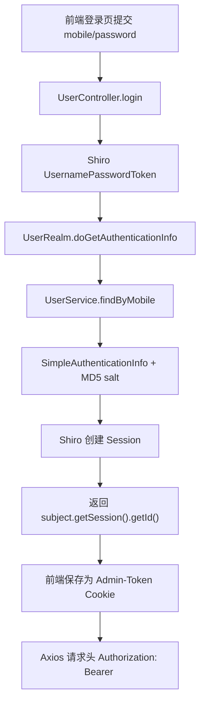
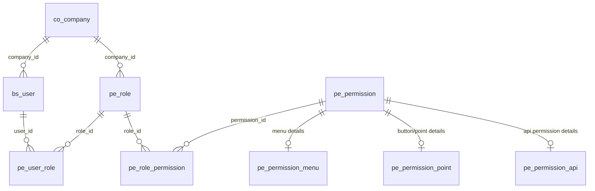

# RBAC 与登录鉴权流程分析

> 结论状态：静态分析，未实际登录验证。  
> 后端根目录：`D:\Files\BaiDu\SaaS项目测试demo\_整理结果\服务端代码-day17最终版`。  
> 前端根目录：`D:\Files\BaiDu\SaaS项目测试demo\_整理结果\客户端代码-day17最终版`。

## 1. 登录流程

登录入口为 `POST /sys/login`，实现文件：`D:\Files\BaiDu\SaaS项目测试demo\_整理结果\服务端代码-day17最终版\ihrm_system\src\main\java\com\ihrm\system\controller\UserController.java`。

静态流程如下：

证据文件：

| 结论 | 文件路径 |
|---|---|
| 登录接口使用 Shiro `UsernamePasswordToken`，返回 Shiro Session ID | `D:\Files\BaiDu\SaaS项目测试demo\_整理结果\服务端代码-day17最终版\ihrm_system\src\main\java\com\ihrm\system\controller\UserController.java` |
| 用户认证由 `UserRealm` 完成，密码使用 mobile 作为 salt | `D:\Files\BaiDu\SaaS项目测试demo\_整理结果\服务端代码-day17最终版\ihrm_system\src\main\java\com\ihrm\system\shiro\realm\UserRealm.java` |
| 前端保存 Cookie key 为 `Admin-Token` | `D:\Files\BaiDu\SaaS项目测试demo\_整理结果\客户端代码-day17最终版\src\utils\auth.js` |
| 前端请求头使用 `Authorization: Bearer ...` | `D:\Files\BaiDu\SaaS项目测试demo\_整理结果\客户端代码-day17最终版\src\utils\request.js` |

## 2. JWT 生成与校验现状

项目存在 JWT 工具和拦截器，但当前主登录链路静态证据显示使用 Shiro Session，而不是 JWT。

| 组件 | 静态结论 | 文件路径 |
|---|---|---|
| JWT 工具类 | 存在 `createJwt`、`parseJwt`；依赖 `jwt.config`；未在当前登录返回链路中确认使用 | `D:\Files\BaiDu\SaaS项目测试demo\_整理结果\服务端代码-day17最终版\ihrm_common\src\main\java\com\ihrm\common\utils\JwtUtils.java` |
| JWT 拦截器 | `@Component` 被注释，静态证据显示未作为 Spring 组件启用 | `D:\Files\BaiDu\SaaS项目测试demo\_整理结果\服务端代码-day17最终版\ihrm_common\src\main\java\com\ihrm\common\interceptor\JwtInterceptor.java` |
| 网关登录过滤器 | `@Component` 被注释，静态证据显示未作为网关过滤器启用 | `D:\Files\BaiDu\SaaS项目测试demo\_整理结果\服务端代码-day17最终版\ihrm_gate\src\main\java\com\ihrm\gate\filter\LoginFilter.java` |
| BaseController JWT 注入 | JWT 解析代码被注释，当前使用 Shiro Subject principal | `D:\Files\BaiDu\SaaS项目测试demo\_整理结果\服务端代码-day17最终版\ihrm_common\src\main\java\com\ihrm\common\controller\BaseController.java` |

结论：Agent 接入时不应假设当前 Token 是 JWT。应按现有行为把前端 Cookie 中的值视为 Shiro Session ID，并通过 `Authorization: Bearer <sessionId>` 透传。该结论依据 `UserController.java`、`CustomSessionManager.java`、`src\utils\request.js`。

## 3. Shiro Realm、Filter 与权限注解

### 3.1 Shiro Session 读取

`CustomSessionManager` 会从请求头 `Authorization` 读取 Session ID，并移除 `Bearer ` 前缀。证据文件：`D:\Files\BaiDu\SaaS项目测试demo\_整理结果\服务端代码-day17最终版\ihrm_common\src\main\java\com\ihrm\common\shiro\session\CustomSessionManager.java`。

### 3.2 系统服务 Shiro 过滤规则

`ihrm_system` 配置了 Shiro Filter：

| 路径 | 规则 | 文件路径 |
|---|---|---|
| `/sys/login` | 匿名 | `D:\Files\BaiDu\SaaS项目测试demo\_整理结果\服务端代码-day17最终版\ihrm_system\src\main\java\com\ihrm\system\ShiroConfiguration.java` |
| `/sys/city/**` | 匿名 | 同上 |
| `/sys/faceLogin/**` | 匿名 | 同上 |
| `/autherror` | 匿名 | 同上 |
| `/**` | `authc` | 同上 |

### 3.3 网关 Shiro 配置

`ihrm_gate` 中 `/sys/login` 与 `/autherror` 匿名放行，`/** authc` 静态扫描中为注释状态。是否在网关层强制所有服务鉴权，证据不足。证据文件：`D:\Files\BaiDu\SaaS项目测试demo\_整理结果\服务端代码-day17最终版\ihrm_gate\src\main\java\com\ihrm\gate\ShiroConfiguration.java`。

### 3.4 Realm 授权逻辑

权限字符串来自 `ProfileResult.roles["apis"]`，随后写入 Shiro `SimpleAuthorizationInfo`。证据文件：`D:\Files\BaiDu\SaaS项目测试demo\_整理结果\服务端代码-day17最终版\ihrm_common\src\main\java\com\ihrm\common\shiro\realm\IhrmRealm.java`。

`UserRealm` 在认证后构造 `ProfileResult`：

| 用户层级 | 权限加载逻辑 | 文件路径 |
|---|---|---|
| 普通 user | 只封装用户基本资料 | `D:\Files\BaiDu\SaaS项目测试demo\_整理结果\服务端代码-day17最终版\ihrm_system\src\main\java\com\ihrm\system\shiro\realm\UserRealm.java` |
| coAdmin 或 saasAdmin | 调用 `PermissionService.findAll(map)` 加载权限；coAdmin 带 `enVisible=1` | 同上 |

当前扫描到的明确方法权限注解：

| 接口 | 权限 | 文件路径 |
|---|---|---|
| `DELETE /sys/user/{id}` | `@RequiresPermissions("API-USER-DELETE")` | `D:\Files\BaiDu\SaaS项目测试demo\_整理结果\服务端代码-day17最终版\ihrm_system\src\main\java\com\ihrm\system\controller\UserController.java` |

除上述接口外，多数 Controller 方法未扫描到明确 `@RequiresPermissions` 注解；是否通过其他机制校验 API 权限，证据不足。

## 4. 用户、角色、权限、菜单、按钮、API 的关系

数据库关系依据：`D:\Files\BaiDu\SaaS项目测试demo\_整理结果\数据库脚本-ihrm-day17最终版.sql`。权限加载依据：`D:\Files\BaiDu\SaaS项目测试demo\_整理结果\服务端代码-day17最终版\ihrm_system\src\main\java\com\ihrm\system\service\PermissionService.java`、`D:\Files\BaiDu\SaaS项目测试demo\_整理结果\服务端代码-day17最终版\ihrm_system\src\main\java\com\ihrm\system\shiro\realm\UserRealm.java`。

| 对象 | 表或代码 | 文件路径 |
|---|---|---|
| 用户 | `bs_user` | `D:\Files\BaiDu\SaaS项目测试demo\_整理结果\数据库脚本-ihrm-day17最终版.sql` |
| 角色 | `pe_role` | 同上 |
| 用户角色 | `pe_user_role` | 同上 |
| 权限主表 | `pe_permission` | 同上 |
| 菜单权限 | `pe_permission_menu` | 同上 |
| 按钮权限 | `pe_permission_point` | 同上 |
| API 权限 | `pe_permission_api` | 同上 |
| 角色权限 | `pe_role_permission` | 同上 |
| 后端权限装配 | `PermissionService.findAll` | `D:\Files\BaiDu\SaaS项目测试demo\_整理结果\服务端代码-day17最终版\ihrm_system\src\main\java\com\ihrm\system\service\PermissionService.java` |

## 5. 前端权限与后端权限一致性

前端权限逻辑：

| 前端能力 | 文件路径 | 静态结论 |
|---|---|---|
| 动态路由白名单、登录态检查 | `D:\Files\BaiDu\SaaS项目测试demo\_整理结果\客户端代码-day17最终版\src\router\index.js` | `/login`、`/reg`、`/authredirect`、`/facelogin` 白名单；登录后拉取用户资料和动态路由。 |
| 菜单和按钮权限判断 | `D:\Files\BaiDu\SaaS项目测试demo\_整理结果\客户端代码-day17最终版\src\utils\permission.js` | 使用 `roles.menus` 判断路由，使用 `roles.points` 判断按钮。 |
| 请求头透传 | `D:\Files\BaiDu\SaaS项目测试demo\_整理结果\客户端代码-day17最终版\src\utils\request.js` | 每次请求带 `Authorization: Bearer <token>`。 |

后端权限逻辑：

| 后端能力 | 文件路径 | 静态结论 |
|---|---|---|
| API 权限装入 Shiro | `D:\Files\BaiDu\SaaS项目测试demo\_整理结果\服务端代码-day17最终版\ihrm_common\src\main\java\com\ihrm\common\shiro\realm\IhrmRealm.java` | 将 `apis` 字符串写入 Shiro 权限集合。 |
| 方法权限注解 | `D:\Files\BaiDu\SaaS项目测试demo\_整理结果\服务端代码-day17最终版\ihrm_system\src\main\java\com\ihrm\system\controller\UserController.java` | 已扫描到 `DELETE /sys/user/{id}` 的权限注解。 |
| 多数业务接口权限注解 | 多个 Controller 文件，详见 `docs\api-inventory-for-agent.md` | 证据不足。 |

判断：前端权限主要控制菜单和按钮展示，后端权限应控制真实 API 访问。当前静态证据显示二者不完全一致：后端 API 权限模型存在，但多数 Controller 方法未见明确权限注解。因此 Agent 调用接口时不能只相信前端按钮权限，也不能因为前端可见就直接调用高风险接口。

## 6. Agent 调用业务接口时如何复用当前用户权限

推荐做法：

| 规则 | 依据文件路径 | 说明 |
|---|---|---|
| Agent Server 必须接收并透传当前用户的 `Authorization: Bearer <sessionId>` | `D:\Files\BaiDu\SaaS项目测试demo\_整理结果\客户端代码-day17最终版\src\utils\request.js`；`D:\Files\BaiDu\SaaS项目测试demo\_整理结果\服务端代码-day17最终版\ihrm_common\src\main\java\com\ihrm\common\shiro\session\CustomSessionManager.java` | 复用 Shiro Session，不创建超级服务账号。 |
| Agent 每次执行前调用 `POST /sys/profile` 确认当前用户、公司、角色 | `D:\Files\BaiDu\SaaS项目测试demo\_整理结果\服务端代码-day17最终版\ihrm_system\src\main\java\com\ihrm\system\controller\UserController.java` | 建立当前用户上下文。 |
| Agent Tool 必须有白名单和风险等级 | `D:\Files\BaiDu\SaaS项目测试demo\_整理结果\docs\api-inventory-for-agent.md` | 禁止模型自由拼接任意 URL。 |
| 只读 MVP 仅开放低风险和少量中风险工具 | `D:\Files\BaiDu\SaaS项目测试demo\_整理结果\docs\agent-integration-design.md` | 薪资、社保、审批、权限、删除类不开放。 |
| 高风险读接口必须二次授权或不开放 | `ihrm_salarys`、`ihrm_social_securitys`、`ihrm_audit` Controller 文件 | 薪资、社保、审批数据属于敏感数据。 |

明确禁止：Agent 不得绕过 Shiro/RBAC 直接访问敏感业务数据；不得使用固定管理员账号批量读取；不得直接读数据库查询薪资、社保、审批、权限数据，除非后续专门设计了同等 RBAC 校验、审计和脱敏能力。

